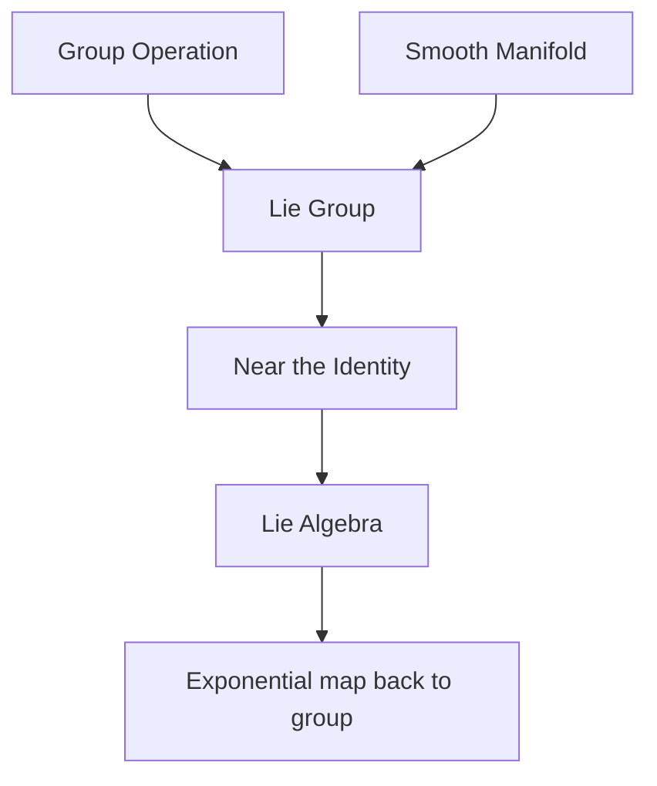

# Lie Groups

## Overview

A Lie group is an object that is both a group and a smooth manifold, so its elements can be combined algebraically and also moved continuously. The classic example is the set of all rotations of space. You can compose two rotations to get another, and you can vary a rotation smoothly by turning the angle. Lie groups capture exactly this idea of continuous symmetry, where the symmetry operations form a smooth space you can do calculus on.

They matter because continuous symmetry is everywhere in mathematics and physics. Near its identity a Lie group is described by its Lie algebra, a flat vector space that linearizes the group and is far easier to analyze. This link between a curved group and its flat algebra is the central tool. The tension is that the group itself can be complicated and curved, so most calculations happen in the algebra and are then lifted back to the group.

### Quick Takeaways

- A Lie group is both a group and a smooth manifold
- It captures continuous symmetry such as rotations
- Its Lie algebra linearizes the group near the identity

## Definition

- **Group** is a set with an associative operation, an identity, and inverses.
- **Manifold** is a space that looks flat and Euclidean near each point.
- **Lie group** is a group that is also a smooth manifold with smooth operations.
- **Lie algebra** is the tangent space at the identity, capturing infinitesimal symmetry.
- **Exponential map** sends Lie algebra elements to group elements.
- **Representation** is a way of realizing group elements as matrices.

## The Analogy

Think of all the ways you can spin a globe. Each spin is a rotation, and you can smoothly dial the spin angle up or down or combine two spins into one. The full collection of spins forms a smooth, continuous space of symmetries. That space, where you can both compose spins and slide between them continuously, is a Lie group.

## When You See It

- Rotations and rigid motions in physics and robotics
- Symmetries underlying the Standard Model of particle physics
- Continuous symmetries linked to conservation laws
- Computer vision and graphics handling 3D orientation
- Control theory on smooth transformation groups
- Harmonic analysis and representation theory

## Examples

**Good:** Representing 3D orientations with the rotation group and using its Lie algebra for smooth interpolation. The algebra makes averaging and blending rotations well behaved.

**Bad:** Treating rotations as if they simply add like plain numbers. Rotations do not commute, so naive addition gives wrong composite orientations.

## Important Points

- A Lie group unites group structure with smooth manifold structure
- The Lie algebra is the tangent space at the identity element
- The exponential map connects the algebra back to the group
- Group elements generally do not commute, unlike numbers
- Representations realize abstract symmetries as concrete matrices
- Noether theorem ties continuous symmetries to conservation laws
- Classification of simple Lie groups is a deep, complete result

## Summary

- A Lie group is both a group and a smooth manifold.
- It models continuous symmetry such as rotations.
- Its Lie algebra linearizes the group near the identity.
- The exponential map lifts algebra elements back to the group.
- Lie groups are central to physics, robotics, and symmetry.
- _They are the smooth spaces where symmetry operations themselves live._
