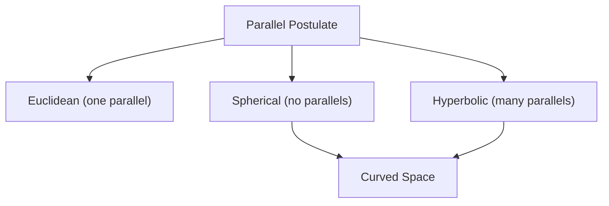
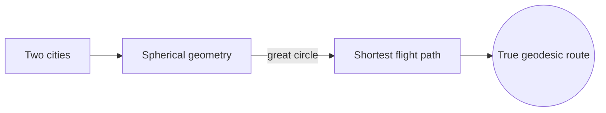
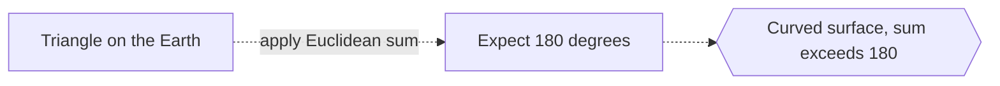

# Non-Euclidean Geometry

## Overview

Non-Euclidean geometry is what you get when you drop or change Euclid parallel postulate. In flat Euclidean space, exactly one parallel line passes through a point off a given line. If you allow no parallels you get spherical geometry, and if you allow many you get hyperbolic geometry. In these worlds the familiar rules bend: triangle angles no longer sum to 180 degrees, and straight lines behave in surprising ways.

This subject matters because our intuition about flat space is not the whole truth. Space can be curved, and once mathematicians accepted that, they discovered consistent geometries no one had imagined. The payoff was enormous. Einstein used curved geometry to describe gravity, treating spacetime itself as non-Euclidean. The tension is that these geometries feel unintuitive, yet they are just as logically valid as the flat one.

### Quick Takeaways

- Changing the parallel postulate creates new, consistent geometries
- Spherical space has no parallels, hyperbolic space has many
- Triangle angle sums differ from 180 degrees when space is curved

## Definition

- **Parallel postulate** is Euclid axiom about how many parallels exist.
- **Spherical geometry** is geometry on a sphere surface, with no parallels.
- **Hyperbolic geometry** is geometry of negative curvature, with many parallels.
- **Curvature** measures how much a space bends away from flat.
- **Geodesic** is the straightest possible path in a curved space.
- **Angle excess** is how far a triangle angle sum exceeds or falls short of 180 degrees.

## The Analogy

Picture drawing a triangle on the surface of a globe using the equator and two lines of longitude. Each longitude meets the equator at a right angle, so the triangle already has two 90-degree angles plus a third at the pole. The angles sum to more than 180 degrees. That impossible-on-paper triangle is normal in spherical, non-Euclidean geometry.

## When You See It

- General relativity describing gravity as curved spacetime
- Navigation and great-circle routes across the globe
- Cartography distorting the round Earth onto flat maps
- Cosmology asking whether the universe is flat, open, or closed
- Art and visualization of hyperbolic tilings
- Modeling networks with tree-like, negatively curved structure

## Examples

**Good:** Using spherical geometry to compute the shortest flight path between two cities. Great circles are the true straight lines on a sphere.

**Bad:** Assuming a triangle drawn on the Earth surface has angles summing to exactly 180 degrees. On the curved surface the sum is always larger.

## Important Points

- Gauss, Bolyai, and Lobachevsky developed hyperbolic geometry independently
- Riemann generalized curved geometry to any number of dimensions
- Positive curvature gives spherical geometry, negative gives hyperbolic
- In spherical geometry triangle angles sum to more than 180 degrees
- In hyperbolic geometry they sum to less than 180 degrees
- These geometries are as logically consistent as the Euclidean one
- Einstein general relativity models spacetime as a curved geometry

## Summary

- Non-Euclidean geometry replaces Euclid parallel postulate.
- Spherical space allows no parallels, hyperbolic space allows many.
- Curvature makes triangle angle sums differ from 180 degrees.
- The geometries are fully consistent, not paradoxes.
- They describe real curved space, including gravity in relativity.
- _It shows that flat space is only one option among many valid worlds._
