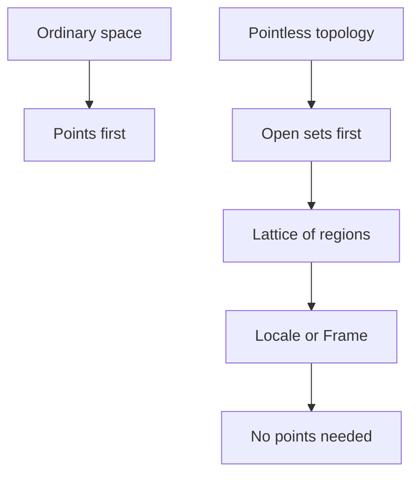

# Pointless Topology

## Overview

Pointless topology, also called point-free topology, rebuilds topology without treating points as the starting objects. In ordinary topology a space is a set of points, and open sets are collections of those points. Pointless topology flips this around. It takes the open sets themselves, organized as a lattice by inclusion, as the primary data, and it never mentions individual points at all. The resulting objects are called frames or locales, and they capture the same structure of regions and how they overlap.

The field matters because points are sometimes an unnecessary or even problematic assumption. Working with regions directly gives cleaner behavior in logic, computer science, and constructive mathematics, where insisting on points can fail. Locales also behave better than spaces in certain constructions. The tension is conceptual: giving up points feels strange, since we picture spaces as made of points. But the region-first view often proves more robust and more general.

### Quick Takeaways

- Pointless topology uses the lattice of open sets, not points
- Its objects, called locales or frames, describe regions and overlap
- It suits logic, computer science, and constructive mathematics

## Definition

- **Frame** is a lattice of open sets closed under the required joins and meets.
- **Locale** is a frame viewed as a space-like object in its own right.
- **Lattice** is a set with meet and join operations, like intersection and union.
- **Open set** here is a primitive element, not a set of points.
- **Meet** corresponds to intersection of regions.
- **Join** corresponds to union of regions.

## The Analogy

Think of describing a territory only by naming its regions and stating which regions overlap or contain others, never pinning down individual locations. You can still reason fully about how the land is arranged. Pointless topology works this way, using the web of regions and their overlaps in place of any notion of a single point.

## When You See It

- Constructive and intuitionistic mathematics
- Domain theory in the semantics of programming languages
- Topos theory and categorical logic
- Situations where points behave badly or do not exist
- Formal reasoning about spatial regions
- Foundations avoiding the axiom of choice

## Examples

**Good:** Using locales to model a space in constructive mathematics where points are not available. The lattice of open sets still supports full topological reasoning.

**Bad:** Insisting every locale comes from an ordinary space of points. Some locales have no underlying points yet remain perfectly meaningful.

## Important Points

- Open sets, organized as a frame, replace points as the primitives
- Locales are the point-free analogue of topological spaces
- Meet and join generalize intersection and union of regions
- The view is natural in constructive and intuitionistic logic
- Some locales have no points yet still behave as spaces
- Locales can be better behaved than spaces in certain constructions
- It connects topology to lattice theory and categorical logic

## Summary

- Pointless topology takes open sets, not points, as fundamental.
- Its objects are frames and locales built as lattices of regions.
- Meet and join generalize intersection and union.
- It fits logic, computer science, and constructive mathematics.
- Some locales have no points yet remain fully meaningful.
- _It describes space through overlapping regions, with no points at all._
