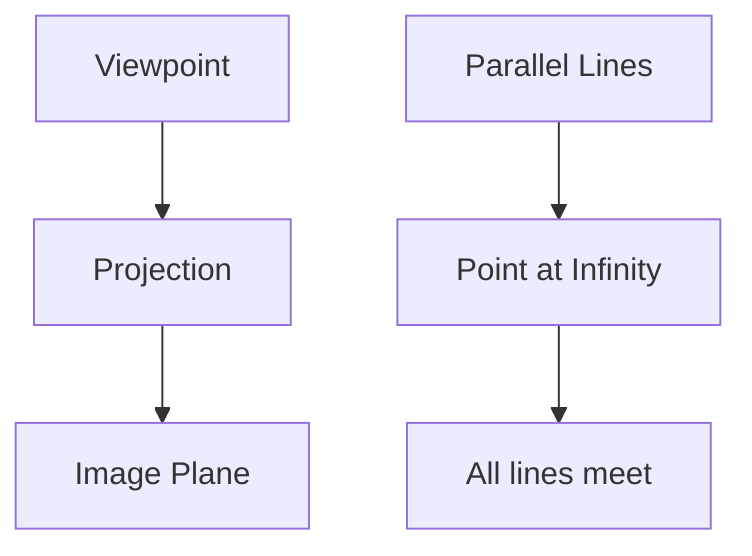

# Projective Geometry

## Overview

Projective geometry studies what stays true under projection, the way a scene maps onto a flat image through a viewpoint. Its boldest move is to add points at infinity so that every pair of lines meets, even parallel ones. In this setting there are no exceptions: any two distinct lines cross at exactly one point, and any two distinct points lie on exactly one line. Distance and angle disappear, and what matters is incidence, which points lie on which lines.

Projective geometry matters because it captures perspective and vision. Painters discovered its rules to draw realistic depth, and cameras obey the same rules. It also unifies geometry by treating all conic sections as one object and by making theorems beautifully symmetric between points and lines. The tension is that giving up distance feels like a loss, but the gain is a cleaner, more symmetric world without special cases.

### Quick Takeaways

- Projective geometry adds points at infinity so parallels meet
- Any two lines meet at one point, any two points share one line
- It preserves incidence and projection, not distance or angle

## Definition

- **Projective plane** is the ordinary plane plus a line of points at infinity.
- **Point at infinity** is where a family of parallel lines is said to meet.
- **Incidence** is the relation of a point lying on a line.
- **Projection** maps points through a viewpoint onto another plane.
- **Duality** is the symmetry that swaps the roles of points and lines.
- **Cross-ratio** is the one numeric quantity projection preserves among four points.

## The Analogy

Look down a long straight railway track. The two rails are parallel, yet to your eye they meet at a single point on the horizon. Projective geometry takes that vanishing point seriously and treats it as a real point where the parallels meet. Perspective drawing is projective geometry made visible.

## When You See It

- Perspective drawing and realistic rendering
- Camera models and computer vision reconstruction
- Unifying ellipses, parabolas, and hyperbolas as one conic
- Image rectification and homography in graphics
- Elegant proofs using point-line duality
- Coding theory and finite projective planes

## Examples

**Good:** Using a homography to correct the perspective distortion of a photographed document. The mapping is exactly a projective transformation.

**Bad:** Trying to read off true distances or angles directly from a projective image. Those metric quantities are not preserved by projection.

## Important Points

- Every pair of distinct lines meets, thanks to points at infinity
- Duality swaps points and lines, turning each theorem into another
- The cross-ratio of four collinear points is a projective invariant
- All conic sections are projectively equivalent to a single curve
- Desargues and Pappus theorems are foundational incidence results
- Homogeneous coordinates give a clean algebraic model of the plane
- Adding structure back can recover affine or Euclidean geometry

## Summary

- Projective geometry adds points at infinity so all lines meet.
- It studies incidence and projection, not distance or angle.
- Point-line duality makes its theorems come in symmetric pairs.
- The cross-ratio is the invariant that projection preserves.
- It models perspective, cameras, and computer vision.
- _It is the geometry of how the world looks through a single eye._
