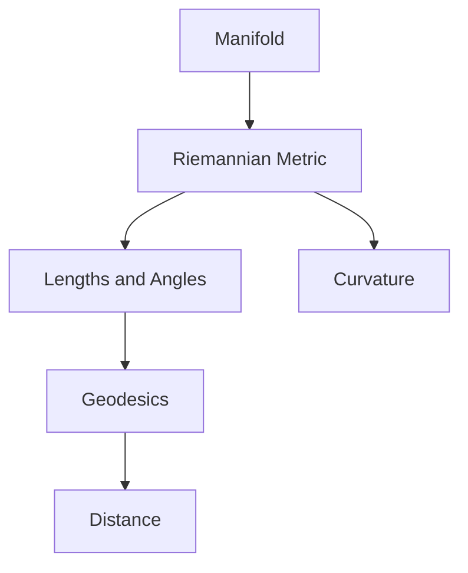
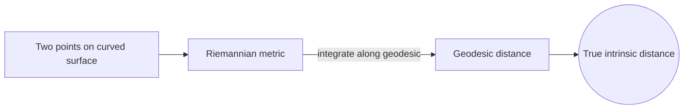
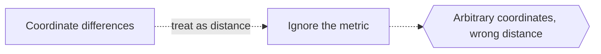

# Riemannian Geometry

## Overview

Riemannian geometry studies smooth spaces, called manifolds, that carry a metric. A metric is a rule that measures the length of tiny tangent vectors at each point, and from it you can compute the length of any curve, the angle between directions, and the distance between points. Once you can measure locally, you can find straightest paths, called geodesics, and quantify how the space curves. The metric can vary from point to point, which is what allows genuinely curved spaces.

This field generalizes both flat Euclidean geometry and curved surfaces to any number of dimensions. It matters because it is the mathematical foundation of general relativity, where spacetime is a Riemannian-style manifold whose curvature is gravity. The tension is that a manifold has no built-in coordinates, so everything must be defined so it does not depend on the arbitrary chart you pick. Getting genuinely coordinate-free, intrinsic definitions is the heart of the subject.

### Quick Takeaways

- A Riemannian metric measures lengths and angles at each point
- From the metric come geodesics, distance, and curvature
- It generalizes curved geometry to any dimension and grounds relativity

## Definition

- **Manifold** is a space that looks like flat Euclidean space near each point.
- **Riemannian metric** assigns a length rule to tangent vectors at each point.
- **Tangent space** is the flat space of directions at a single point.
- **Geodesic** is a locally shortest, straightest path on the manifold.
- **Curvature tensor** encodes how the space bends in every direction.
- **Sectional curvature** measures bending in a chosen two-dimensional slice.

## The Analogy

Picture a landscape where, standing anywhere, you have a small local ruler and protractor that may differ slightly from spot to spot. Using only these local tools you can measure any hike length, find the flattest route, and sense whether the terrain domes or dips. Riemannian geometry is the mathematics of navigating with such point-by-point measuring tools.

## When You See It

- General relativity modeling gravity as curved spacetime
- Geodesy computing distances on the curved Earth
- Machine learning on curved data manifolds
- Robotics planning on curved configuration spaces
- Shape analysis comparing curved surfaces
- Optimization along geodesics in curved parameter spaces

## Examples

**Good:** Computing geodesic distance between two points on a curved surface using its metric. The metric gives the true intrinsic distance, not a flat approximation.

**Bad:** Assuming coordinate differences equal true distances on a curved manifold. Coordinates are arbitrary, so raw differences ignore the metric.

## Important Points

- The metric is the single object from which all measurements follow
- Geodesics generalize straight lines as locally shortest paths
- The curvature tensor captures bending in every direction
- All valid definitions must be independent of chosen coordinates
- Riemann extended Gauss surface theory to any dimension
- General relativity is built on this geometry, with curvature as gravity
- Constant-curvature spaces recover spherical, flat, and hyperbolic geometry

## Summary

- Riemannian geometry studies manifolds equipped with a metric.
- The metric gives lengths, angles, distances, and curvature.
- Geodesics are the straightest, locally shortest paths.
- Everything is defined intrinsically, free of coordinate choice.
- It is the foundation of general relativity and modern geometry.
- _It measures curved space with rulers that shift from point to point._
