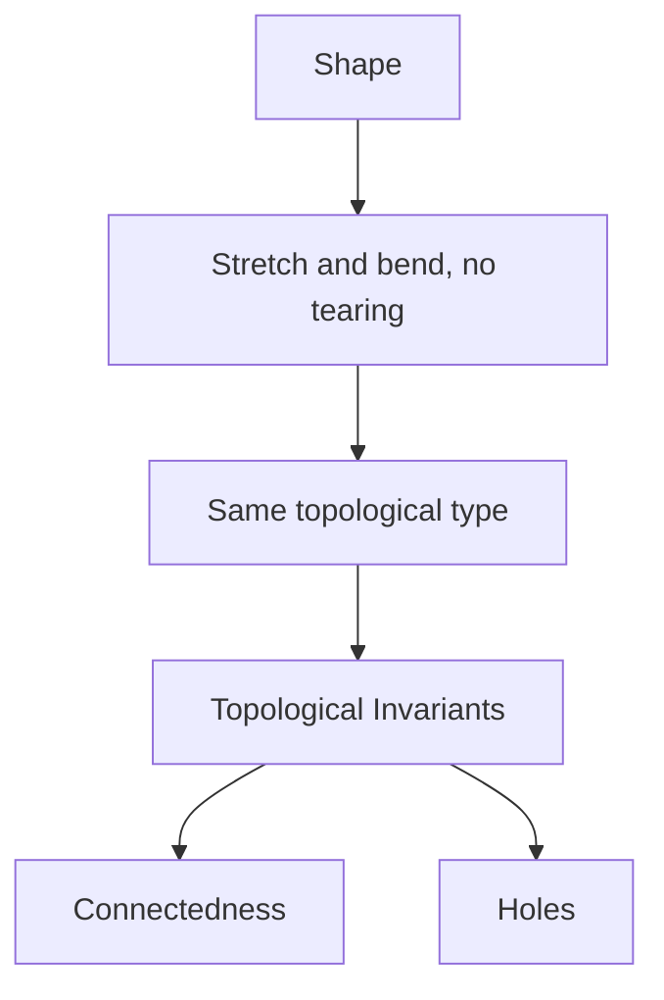

# Topology

## Overview

Topology studies the properties of shapes that survive continuous deformation. If you can stretch, bend, or twist an object without tearing or gluing, topology treats the before and after as the same. Distance and angle are irrelevant. What matters is coarse structure like whether a shape is connected, whether it has holes, and how its pieces fit together. This is why a coffee mug and a doughnut are topologically identical: each has exactly one hole.

Topology matters because many important properties are exactly the ones that ignore size and rigidity. Continuity, connectedness, and the presence of holes are fundamental to analysis, geometry, and physics. The tension is that topology is very flexible, so it cannot see fine geometric detail, only the qualitative shape. Its power comes from inventing invariants, numbers or algebraic objects that stay the same under deformation and so can tell shapes apart.

### Quick Takeaways

- Topology studies properties preserved under continuous deformation
- It ignores distance and angle, keeping only qualitative shape
- Invariants like holes distinguish shapes that cannot be deformed into each other

## Definition

- **Topological space** is a set with a notion of nearness given by open sets.
- **Open set** is a basic building block defining which points are close.
- **Continuous map** is a function that does not tear the space apart.
- **Homeomorphism** is a continuous, reversible map making two spaces equivalent.
- **Invariant** is a quantity unchanged by continuous deformation.
- **Connectedness** is whether a space is in one piece.

## The Analogy

Imagine every shape is made of infinitely stretchy clay you may bend and pull but never cut or fuse. Under those rules a ball and a cube are the same, and a mug and a doughnut are the same because each has one handle-hole. Topology is the study of exactly what you can still tell apart when only such stretching is allowed.

## When You See It

- Analysis defining continuity and limits abstractly
- Data analysis finding the shape of high-dimensional data
- Physics classifying topological phases and defects
- Network and connectivity questions
- Robotics reasoning about configuration spaces
- Distinguishing surfaces by their number of holes

## Examples

**Good:** Recognizing that a coffee mug and a doughnut are the same shape because each has one hole. Topology captures exactly this deformation equivalence.

**Bad:** Using topology alone to measure the exact length of a curve. Topology ignores distance, so length is simply invisible to it.

## Important Points

- Topology keeps only properties invariant under continuous deformation
- Open sets are the primitive notion encoding nearness
- Homeomorphic spaces are considered topologically identical
- Holes and connectedness are basic distinguishing features
- Invariants are the main tools for telling spaces apart
- It splits into general, algebraic, geometric, and differential branches
- It underlies rigorous definitions of continuity and convergence

## Summary

- Topology studies what survives continuous stretching and bending.
- It ignores distance and angle, keeping qualitative shape.
- Homeomorphic spaces count as the same object.
- Invariants like holes and connectedness distinguish shapes.
- It provides the foundation for continuity across mathematics.
- _It sees the shape of things once size and rigidity fall away._
