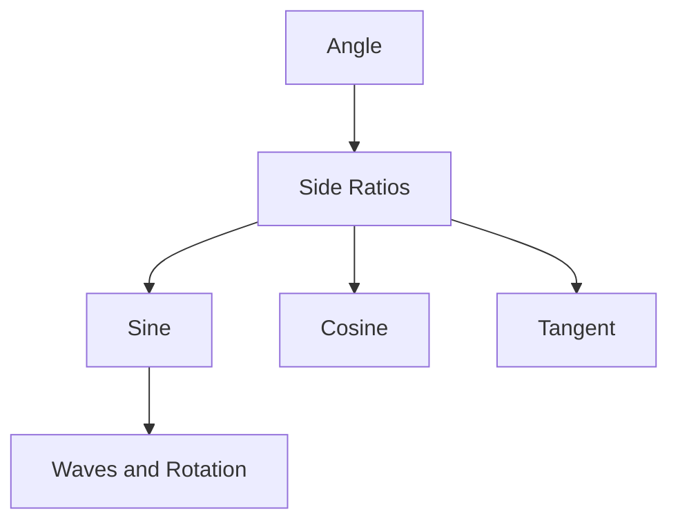
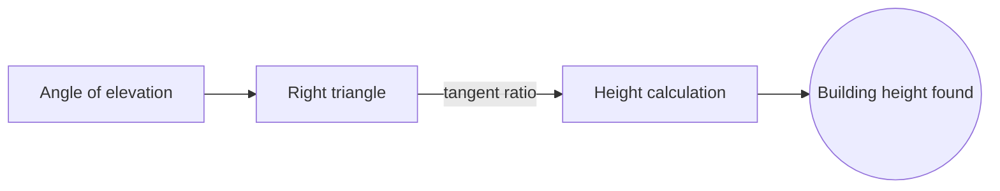

# Trigonometry

## Overview

Trigonometry studies how the angles of a triangle relate to the lengths of its sides. It grows from one simple fact: in a right triangle, the ratios of the sides depend only on the angles, not on the triangle size. These ratios get names, sine, cosine, and tangent, and once you know an angle you know the ratios. From that seed you can solve any triangle and measure things you cannot reach directly.

Trigonometry matters because it turns angles into numbers you can compute with. Surveyors, sailors, and engineers use it to find distances and heights indirectly. It also connects to waves and rotation, since sine and cosine describe circular and periodic motion. The main tension is remembering that the basic ratios assume a right triangle, and the law of sines and cosines are what extend the ideas to any triangle.

### Quick Takeaways

- Trigonometry links triangle angles to side-length ratios
- Sine, cosine, and tangent depend only on the angle, not the size
- It measures unreachable distances and describes periodic motion

## Definition

- **Sine** is the ratio of the opposite side to the hypotenuse.
- **Cosine** is the ratio of the adjacent side to the hypotenuse.
- **Tangent** is the ratio of the opposite side to the adjacent side.
- **Hypotenuse** is the longest side of a right triangle, opposite the right angle.
- **Radian** is an angle measure based on arc length, natural for calculus.
- **Unit circle** is a circle of radius one that defines the functions for all angles.

## The Analogy

Imagine standing at the base of a tall tree and wanting its height without climbing. You step back a known distance and measure the angle up to the top. The tree, the ground, and your line of sight form a right triangle. Trigonometry is the tool that turns that one measured angle into the tree height you cannot reach.

## When You See It

- Surveying land and measuring heights indirectly
- Navigation by bearings and angles at sea or in the air
- Physics of waves, oscillations, and rotation
- Computer graphics rotating and positioning objects
- Signal processing decomposing signals into sine waves
- Engineering forces resolved into components along axes

## Examples

**Good:** Finding a building height by measuring the angle of elevation from a known distance. The right triangle and its ratios give the answer directly.

**Bad:** Applying the plain sine ratio to a triangle with no right angle. Without a right angle you need the law of sines or cosines instead.

## Important Points

- The basic ratios sine, cosine, and tangent are defined on a right triangle
- The unit circle extends the functions to angles beyond 90 degrees
- Sine and cosine are periodic, which links them to waves and rotation
- The Pythagorean identity sin squared plus cos squared equals one is foundational
- The law of sines and law of cosines solve non-right triangles
- Radians, not degrees, are the natural angle unit in calculus
- Inverse functions recover an angle from a known ratio

## Summary

- Trigonometry relates triangle angles to side-length ratios.
- Sine, cosine, and tangent depend only on the angle, not the size.
- It lets you measure heights and distances you cannot reach.
- The unit circle extends the ideas to all angles and to waves.
- Laws of sines and cosines handle triangles without a right angle.
- _Trigonometry is the art of turning a measured angle into a distance._
