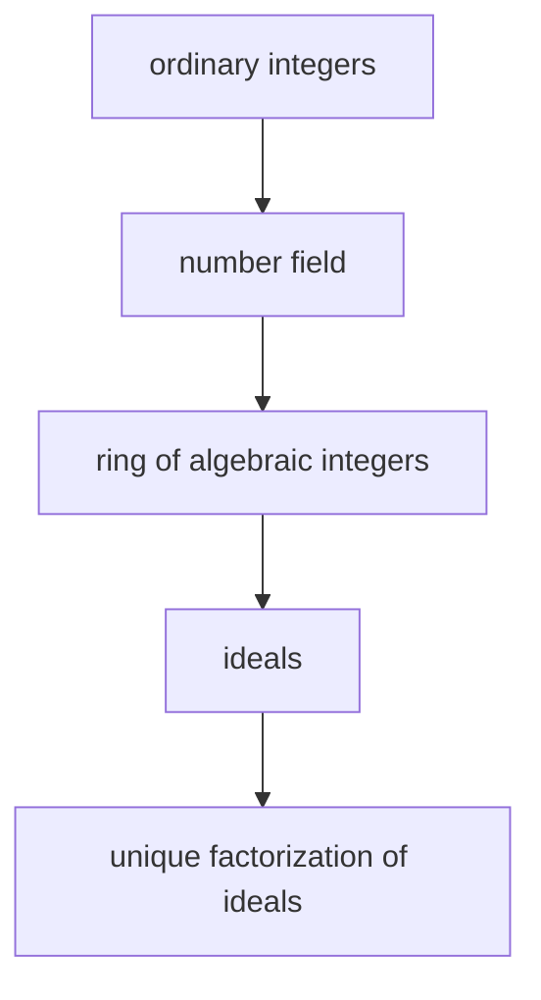

# Algebraic Number Theory

## Overview

Algebraic number theory studies whole-number questions by enlarging the number system. Instead of staying inside the ordinary integers, it works in number fields, which are built by adjoining roots of polynomials, such as the square root of two or the imaginary unit. Inside each new system lives a set of algebraic integers that behaves like the familiar integers. The goal is to understand divisibility, factorization, and equations in these richer settings, then pull conclusions back to the plain integers.

This branch matters because unique factorization can break down once you leave the ordinary integers. In some number systems a number factors into irreducibles in more than one way. Fixing this failure led to the idea of ideals, which restore unique factorization at a higher level. The tension between numbers that no longer factor uniquely and ideals that always do is the heart of the subject, and it powers deep results about equations and primes.

### Quick Takeaways

- Number fields extend the integers by adjoining roots of polynomials
- Unique factorization can fail for numbers but is restored for ideals
- The tools reveal integer facts that plain arithmetic cannot easily reach

## Definition

- **Number field** is a finite extension of the rational numbers formed by adjoining algebraic roots.
- **Algebraic integer** is a root of a monic polynomial with ordinary integer coefficients.
- **Ring of integers** is the set of all algebraic integers inside a given number field.
- **Ideal** is a subset closed under addition and under multiplication by any ring element.
- **Prime ideal** is an ideal that plays the role of a prime for factorization of ideals.
- **Class number** is a count that measures how badly unique factorization of numbers fails.

## The Analogy

Imagine the ordinary integers as a small town where every address is unique. When you move to a bigger city, some houses share the same street name, so a plain address is no longer enough. Ideals act like adding a postal code, a higher label that makes every location unique again. You lose clean addressing at the house level but recover it at the coded level. The bigger city is the number field, and the postal codes are the prime ideals.

## When You See It

- Solving Diophantine equations that resist ordinary integer methods
- Studying which primes split, stay whole, or ramify in a larger field
- Fermat-style problems that need factorization inside extended systems
- Class field theory describing abelian extensions of number fields
- Elliptic curve cryptography that lives over structured number systems
- Understanding units and the structure of solutions to Pell-like equations

## Examples

**Good:** Factoring in the Gaussian integers to show which ordinary primes are sums of two squares. The extended system makes a hard integer fact fall out cleanly.

**Bad:** Assuming numbers in every number field factor uniquely like ordinary integers. That assumption fails, and it led to famous flawed attempts at Fermat's Last Theorem.

## Important Points

- Every number field has a ring of integers that generalizes the ordinary integers
- Ideals were invented precisely to repair the failure of unique factorization
- The class number is one when unique factorization of numbers still holds
- Primes behave in three ways in an extension, they split, remain inert, or ramify
- Units in a ring of integers are described by Dirichlet's unit theorem
- Ramification connects to the discriminant, a number that flags trouble spots
- The field links tightly to Galois theory and to analytic tools like L-functions

## Summary

- Algebraic number theory extends the integers into number fields to study them.
- Algebraic integers inside those fields play the role of ordinary integers.
- Unique factorization can fail for numbers but always holds for ideals.
- The class number measures how far a field is from unique factorization.
- The subject solves integer problems that plain arithmetic cannot reach.
- _Widen the number system and hidden structure comes into view._
