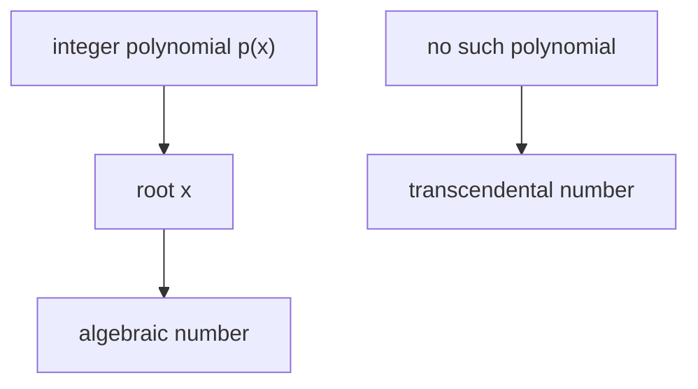
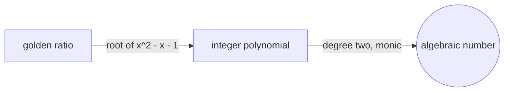

# Algebraic Numbers

## Overview

An algebraic number is any number that is a root of a nonzero polynomial with integer coefficients. Every rational number qualifies, since a over b solves the equation b times x minus a equals zero. Many irrationals qualify too, such as the square root of two, which solves x squared minus two equals zero. The defining idea is that the number can be pinned down exactly as the solution of a whole-number polynomial equation.

Algebraic numbers matter because they mark the boundary between numbers that arise from polynomial equations and those that do not. Numbers that are not algebraic are called transcendental, and famous examples include pi and the number e. Almost every real number is transcendental, yet the ones we name and compute with are usually algebraic. The tension is that algebraic numbers feel abundant and familiar, but they are actually a countable, thin set inside the uncountable reals.

### Quick Takeaways

- An algebraic number is a root of an integer-coefficient polynomial
- Every rational and many irrationals like the square root of two are algebraic
- Numbers that are not algebraic are transcendental, such as pi and e

## Definition

- **Algebraic number** is a root of a nonzero polynomial with integer coefficients.
- **Transcendental number** is a number that is not the root of any such polynomial.
- **Minimal polynomial** is the lowest-degree monic polynomial with the number as a root.
- **Degree** is the degree of that minimal polynomial for the number.
- **Algebraic integer** is an algebraic number whose minimal polynomial is monic with integer coefficients.
- **Conjugates** are the other roots of the same minimal polynomial.

## The Analogy

Think of algebraic numbers as addresses that a polynomial equation can point to exactly. Give the equation and it names the number with no ambiguity, like coordinates locating a house. Transcendental numbers are like places no polynomial map can reach, no matter how large you make the equation. Pi has a spot on the line, but no integer polynomial equation ever lands on it. Algebraic numbers are the reachable addresses, transcendental ones are the unreachable gaps.

## When You See It

- Solving polynomial equations where the roots are exact algebraic values
- Constructions with compass and straightedge, which reach only certain algebraic numbers
- Field extensions in algebra built by adjoining algebraic roots
- Symbolic computation that keeps values exact rather than decimal
- Proving a number like pi is transcendental to settle squaring the circle
- Coding and cryptography over structured algebraic number fields

## Examples

**Good:** Recognizing the golden ratio as algebraic because it solves x squared minus x minus one equals zero. Its minimal polynomial has integer coefficients and degree two.

**Bad:** Assuming pi is algebraic and expecting a finite integer polynomial to have it as a root. Pi is transcendental, so no such polynomial exists, and squaring the circle is impossible.

## Important Points

- Rational numbers are exactly the algebraic numbers of degree one
- The algebraic numbers form a field, closed under the four operations
- They are countable, so almost every real number is transcendental
- Each algebraic number has a unique minimal polynomial that fixes its degree
- Algebraic integers are the subset with monic integer minimal polynomials
- Proving a specific number transcendental is usually very hard
- The distinction resolved classic problems like squaring the circle

## Summary

- An algebraic number is a root of an integer-coefficient polynomial.
- Rationals and many irrationals such as the square root of two are algebraic.
- Numbers with no such polynomial are transcendental, like pi and e.
- The algebraic numbers form a countable field inside the uncountable reals.
- The algebraic versus transcendental split settled old geometry problems.
- _Most numbers escape every polynomial, though the ones we name rarely do._
