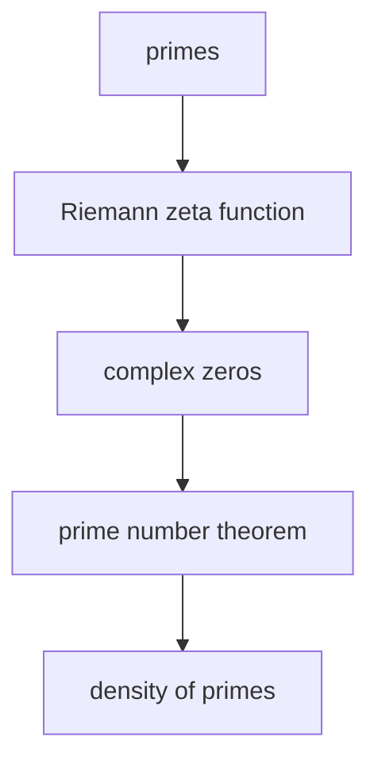
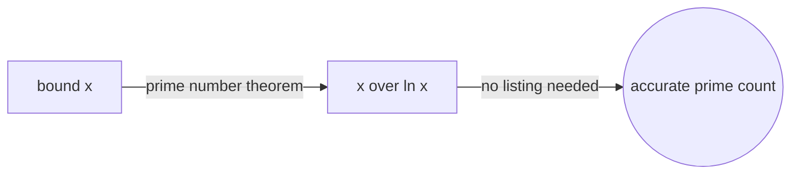
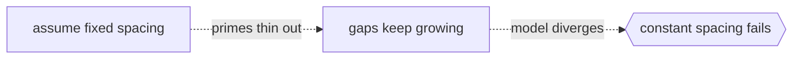

# Analytic Number Theory

## Overview

Analytic number theory studies integers using the tools of continuous mathematics. It applies limits, integrals, infinite series, and complex functions to answer questions about discrete objects like primes. The surprising move is to attack whole-number problems with methods that live in the smooth world of calculus. By packing arithmetic data into functions, you can use the powerful machinery of analysis to extract counts and estimates that pure counting cannot give.

The branch matters most for understanding how primes spread out among the integers. Primes look scattered and random up close, yet their overall density follows a smooth law. The prime number theorem says the count of primes up to a number grows like that number divided by its natural logarithm. The Riemann zeta function ties prime behavior to the location of complex zeros, and the still open Riemann hypothesis is the deepest question in the field.

### Quick Takeaways

- Analytic number theory studies integers with calculus and complex analysis
- The prime number theorem describes how densely primes appear
- The zeta function links prime distribution to the zeros of a complex function

## Definition

- **Dirichlet series** is an infinite sum that encodes an arithmetic sequence as a function.
- **Riemann zeta function** is the sum of one over n to the power s, extended to the complex plane.
- **Prime counting function** is the count of primes up to a given real number.
- **Prime number theorem** is the statement that primes up to x are about x over the natural log of x.
- **L-function** is a Dirichlet series attached to arithmetic data, generalizing the zeta function.
- **Analytic continuation** is the extension of a function to a larger domain while staying consistent.

## The Analogy

Picture primes as raindrops hitting a long sidewalk. Any single drop lands unpredictably, so you cannot forecast the next spot. But if you measure the wet fraction over a long stretch, a smooth rate appears. Analytic number theory studies that smooth rate rather than each drop. It trades the impossible task of predicting each prime for the achievable task of describing their average density with a clean formula.

## When You See It

- Estimating how many primes lie below a very large bound
- Proving that primes appear in every valid arithmetic progression
- Bounding gaps between consecutive primes
- Studying sums that count divisors or measure multiplicative structure
- Cryptographic key sizing that depends on prime density estimates
- Sieve methods that count integers avoiding certain prime factors

## Examples

**Good:** Using the prime number theorem to estimate that there are roughly x over ln x primes below x, giving a fast and accurate density figure without listing them.

**Bad:** Trying to describe prime gaps with a single fixed spacing. Primes thin out and their gaps grow, so any constant spacing model breaks down quickly.

## Important Points

- Euler linked the zeta function to primes through an infinite product over all primes
- The prime number theorem was proven using zeros of the zeta function off the real axis
- The Riemann hypothesis predicts all nontrivial zeros lie on a single vertical line
- Dirichlet used L-functions to prove infinitely many primes in arithmetic progressions
- Sieve methods give upper and lower bounds by filtering out multiples of small primes
- Error terms in prime counting shrink dramatically if the Riemann hypothesis holds
- The methods are estimates and bounds rather than exact closed formulas

## Summary

- Analytic number theory studies integers using calculus and complex analysis.
- Encoding arithmetic in functions unlocks powerful tools for counting.
- The prime number theorem captures the average density of the primes.
- The zeta function connects primes to the location of complex zeros.
- The Riemann hypothesis remains the central open problem of the field.
- _Smooth analysis reveals the hidden regularity in scattered primes._
