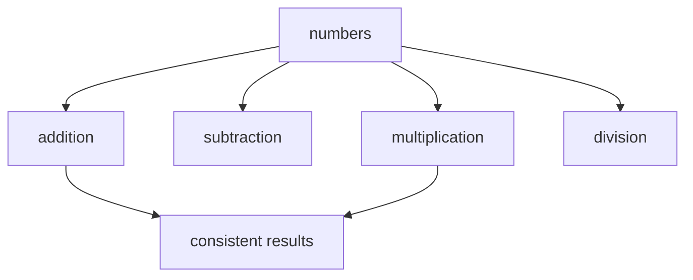
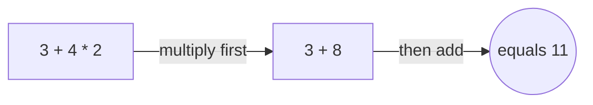
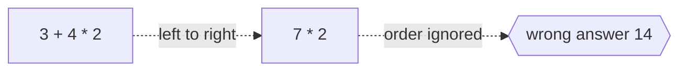

# Arithmetic

## Overview

Arithmetic is the study of numbers and the basic operations that combine them. The four core operations are addition, subtraction, multiplication, and division. From these you build everything else, including fractions, powers, and roots. Arithmetic starts from the plain act of counting and grows into a set of rules that always give consistent answers. It is the first mathematics anyone learns and the ground that all higher mathematics stands on.

Arithmetic matters because it is the shared language of quantity. Every science, trade, and daily task uses it to measure, compare, and combine amounts. The rules are not arbitrary, they follow from the structure of numbers and hold everywhere. The tension in arithmetic is between the simple operations we perform by habit and the deep properties, like commutativity and distributivity, that make those operations reliable and provable.

### Quick Takeaways

- Arithmetic covers numbers and the operations of add, subtract, multiply, and divide
- The operations follow fixed laws that guarantee consistent results
- It is the foundation on which all other mathematics is built

## Definition

- **Addition** is combining two quantities into a single total.
- **Subtraction** is finding the difference by removing one quantity from another.
- **Multiplication** is repeated addition of a quantity a whole number of times.
- **Division** is splitting a quantity into equal parts or counting how many fit.
- **Order of operations** is the fixed rule for which operation to evaluate first.
- **Identity element** is the value that leaves a number unchanged, zero for addition and one for multiplication.

## The Analogy

Think of arithmetic as the basic grammar of numbers. Just as grammar tells you how words combine into correct sentences, arithmetic tells you how numbers combine into correct results. You do not invent new grammar for each sentence, you follow shared rules so everyone reads the same meaning. In the same way, everyone who follows the rules of arithmetic reaches the same answer, which is what makes numbers a trustworthy language.

## When You See It

- Counting money, making change, and balancing a budget
- Measuring ingredients and scaling a recipe up or down
- Computing distances, speeds, and travel times
- Any spreadsheet formula that sums, averages, or scales values
- Low-level computer operations on integers and floating-point numbers
- The first steps of nearly every larger mathematical calculation

## Examples

**Good:** Applying the order of operations to evaluate three plus four times two as eleven, since multiplication is done before addition. The fixed rule removes any ambiguity.

**Bad:** Reading three plus four times two left to right as fourteen. Ignoring the order of operations gives a wrong and inconsistent answer.

## Important Points

- Addition and multiplication are commutative, the order of the two inputs does not change the result
- Both are associative, so grouping of three or more terms does not change the result
- Multiplication distributes over addition, which links the two operations
- Division by zero is undefined because no consistent value can satisfy it
- Subtraction and division are the inverse operations of addition and multiplication
- The order of operations is a convention that keeps written expressions unambiguous
- Arithmetic extends smoothly from whole numbers to fractions, decimals, and negatives

## Summary

- Arithmetic studies numbers and the four core operations on them.
- Its operations obey fixed laws that make results consistent everywhere.
- Identities, inverses, and the order of operations keep the system coherent.
- It is the first mathematics learned and the base for all that follows.
- Every measurement and calculation ultimately rests on arithmetic.
- _Master the plain operations and the rest of mathematics has firm ground._
