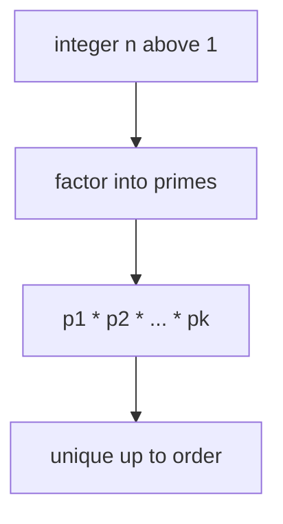

# Fundamental Theorem of Arithmetic

## Overview

The fundamental theorem of arithmetic states that every integer greater than one is either prime or can be written as a product of primes, and that this prime factorization is unique except for the order of the factors. In short, primes are the atoms of the integers, and each integer has exactly one recipe of prime atoms. You can shuffle the order but you cannot change which primes appear or how many times each one appears.

This theorem matters because it turns the integers into a system with a single, well-defined structure. Once you know the prime factorization of a number, you know its divisors, its greatest common divisors with others, and much more. The uniqueness is the crucial part. Without it, arithmetic would lose the clean bookkeeping that lets us reason about divisibility. The theorem is the foundation that makes number theory tidy and predictable.

### Quick Takeaways

- Every integer above one factors into primes, and the factorization is unique
- Order of the prime factors does not count as a different factorization
- The theorem makes primes the true building blocks of the integers

## Definition

- **Prime** is an integer above one divisible only by one and itself.
- **Prime factorization** is the expression of an integer as a product of primes.
- **Existence** is the claim that such a prime product always exists for integers above one.
- **Uniqueness** is the claim that only one such product exists apart from ordering.
- **Multiplicity** is the number of times a given prime appears in the factorization.
- **Canonical form** is the factorization written with primes in increasing order and exponents.

## The Analogy

Think of an integer as a finished smoothie and primes as the pure fruits blended into it. Every smoothie above the empty one is made from some exact combination of fruits. If two people blend the same fruits in the same amounts, they get the same smoothie, no matter the order they added them. And if you have a smoothie, there is only one fruit recipe that produced it. The fruits are the primes and the recipe is the unique factorization.

## When You See It

- Reducing a fraction to lowest terms by canceling shared prime factors
- Computing the greatest common divisor and least common multiple from factorizations
- Proving that the square root of two is irrational using prime parity
- RSA key generation, which relies on factoring being hard for large numbers
- Counting divisors of a number from the exponents in its factorization
- Checking whether one integer divides another by comparing prime powers

## Examples

**Good:** Writing sixty as two squared times three times five. Any correct factorization of sixty gives exactly these primes with these exponents, only the order can differ.

**Bad:** Claiming a number has two genuinely different prime factorizations. For ordinary integers that is impossible, and believing it leads to false conclusions about divisibility.

## Important Points

- The number one is excluded from the primes so that factorization stays unique
- The proof has two parts, existence by repeated factoring and uniqueness by Euclid's lemma
- Euclid's lemma says if a prime divides a product it divides one of the factors
- Uniqueness fails in some larger number systems, which motivated the theory of ideals
- Divisor counts and sums follow directly from the exponents in the factorization
- Greatest common divisor is the product of shared primes at their smallest exponents
- The theorem underlies the security assumptions of factoring-based cryptography

## Summary

- Every integer above one has a prime factorization, and it is unique up to order.
- Primes are the atoms of the integers and each number has one atomic recipe.
- The uniqueness half rests on Euclid's lemma about primes dividing products.
- Divisors, gcd, and lcm all fall out of the prime factorization.
- The theorem is the structural backbone of number theory and cryptography.
- _One number, one prime recipe, no exceptions among the integers._
