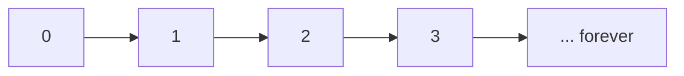

# Natural Numbers

## Overview

The natural numbers are the counting numbers, the ones you use to say how many objects are in a group. Depending on convention they start at zero or at one and continue without end, one, two, three, and so on forever. They are the most basic numbers, born directly from the act of counting. Every other number system is built by extending them to cover new needs like debts, parts, and continuous measurement.

Natural numbers matter because they are the foundation of arithmetic and number theory. They can be defined rigorously from a few simple rules, the Peano axioms, which say there is a starting number and every number has a unique next one. From that seed, addition, multiplication, and ordering all follow. The key tension is between their childlike simplicity and the fact that the hardest open problems in mathematics, like the distribution of primes, live entirely inside them.

### Quick Takeaways

- Natural numbers are the counting numbers, starting at zero or one
- They can be built from the Peano axioms using a start and a successor rule
- They are simple to state yet host the deepest unsolved problems

## Definition

- **Successor** is the operation that gives the next natural number after a given one.
- **Zero** is the natural number that is not the successor of any natural number.
- **Peano axioms** are the rules that define the naturals from zero and the successor.
- **Induction** is the proof method that verifies a base case and a step to cover all naturals.
- **Well-ordering** is the property that every nonempty set of naturals has a least element.
- **Cardinality** is the use of a natural number to measure the size of a finite set.

## The Analogy

Think of natural numbers as an endless staircase with a first step. You always know where the bottom is, and from any step there is exactly one step directly above. You climb by taking the successor, one step at a time, and you can never run out of steps. Counting a group is just walking up the stairs once per object. The staircase never loops and never branches, which is what makes counting unambiguous.

## When You See It

- Counting items, people, or events in everyday life
- Indexing positions in a list or sequence
- Measuring the size of a finite collection
- Proving statements for all cases using mathematical induction
- Defining recursion where each result depends on the previous
- Serving as the base for building integers, rationals, and beyond

## Examples

**Good:** Using induction to prove a formula holds for every natural number by checking the first case and showing each case forces the next. This covers infinitely many cases with one argument.

**Bad:** Using natural numbers to record a temperature that drops below zero. Naturals have no negatives, so the quantity does not fit and you need integers instead.

## Important Points

- Whether zero is included is a convention that varies by field and author
- The Peano axioms pin down the naturals up to a relabeling of the symbols
- Induction and well-ordering are equivalent and both hold for the naturals
- Addition and multiplication are defined by recursion on the successor
- The naturals are infinite yet countable, the smallest kind of infinity
- They are closed under addition and multiplication but not subtraction or division
- Primes, factorization, and most of number theory live inside the naturals

## Summary

- Natural numbers are the counting numbers starting at zero or one.
- The Peano axioms build them from a start and a successor rule.
- Induction proves statements across all of them with a base and a step.
- They are closed under addition and multiplication but not under subtraction.
- Simple as they are, they hold the deepest problems in number theory.
- _Counting seems trivial, yet it is where the hardest questions begin._
