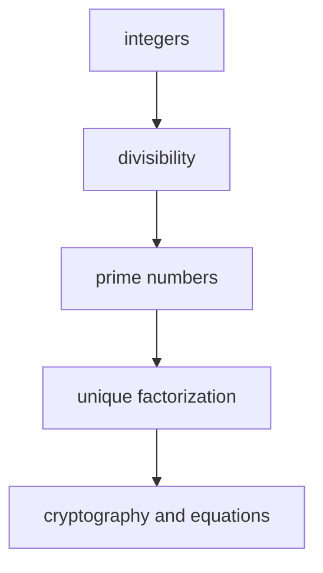

# Number Theory

## Overview

Number theory is the study of the integers and the whole numbers built from them. It asks simple questions with deep answers. Which numbers divide which others, how numbers factor into primes, and which equations have solutions in whole numbers. The objects are the most basic in mathematics, the counting numbers, yet the patterns hiding among them run very deep. You start from first principles, addition and multiplication of integers, and you follow the structure that those two operations force.

Number theory matters because integers are the backbone of exact reasoning. Primes act like atoms, since every integer above one factors into primes in exactly one way. That fact anchors much of the field. The subject also sits at the center of modern cryptography, where the hardness of factoring large numbers keeps secrets safe. The tension is that the questions look elementary while the proofs often demand tools from algebra, analysis, and geometry.

### Quick Takeaways

- Number theory studies integers, divisibility, and the way numbers factor into primes
- Primes are the building blocks, and factorization into primes is unique
- Simple looking questions can require deep tools and still stay open for centuries

## Definition

- **Integer** is a whole number, positive, negative, or zero, with no fractional part.
- **Divisibility** is the relation where one integer divides another with no remainder.
- **Prime** is an integer above one whose only positive divisors are one and itself.
- **Composite** is an integer above one that has a divisor other than one and itself.
- **Congruence** is the statement that two integers leave the same remainder on division by a fixed modulus.
- **Diophantine equation** is a polynomial equation for which we seek integer solutions.

## The Analogy

Think of the integers as a huge set of LEGO structures, and the primes as the individual bricks. Every structure above the smallest one can be taken apart into bricks in exactly one way. If you know the bricks, you know the structure. Number theory is the practice of studying which bricks exist, how they combine, and what you can build. The rules of building are fixed by simple counting, yet the finished structures show surprising order.

## When You See It

- RSA and other public-key cryptography that rely on the difficulty of factoring
- Hashing and checksums that use modular arithmetic to detect errors
- Puzzles about remainders, clocks, and calendars that reduce to congruences
- Questions about whether an equation has whole-number solutions
- Random number generators built on modular recurrences
- Coding theory that packs and protects data using integer structure

## Examples

**Good:** Proving that there are infinitely many primes by assuming a finite list, multiplying them, and adding one to force a new prime factor. This uses only divisibility and pure logic.

**Bad:** Trying to settle a claim about all integers by checking the first million cases and calling it proven. Number theory is full of patterns that hold for huge ranges and then fail.

## Important Points

- The fundamental theorem of arithmetic guarantees unique prime factorization for every integer above one
- Modular arithmetic reduces infinite integer problems to finite systems of remainders
- The greatest common divisor is computed fast by the Euclidean algorithm
- Analytic tools connect prime counting to the behavior of continuous functions
- Algebraic tools extend integers to larger number systems to solve harder equations
- Many easy to state problems, like the Goldbach conjecture, remain unproven
- Cryptography turned number theory from pure study into critical infrastructure

## Summary

- Number theory studies integers, divisibility, primes, and integer equations.
- Primes are the atoms of the integers and factorization into them is unique.
- Congruences and modular arithmetic organize integer problems into finite systems.
- The field blends elementary questions with deep algebraic and analytic methods.
- Its results now secure real communication through modern cryptography.
- _The numbers we count with hold more structure than they first reveal._
