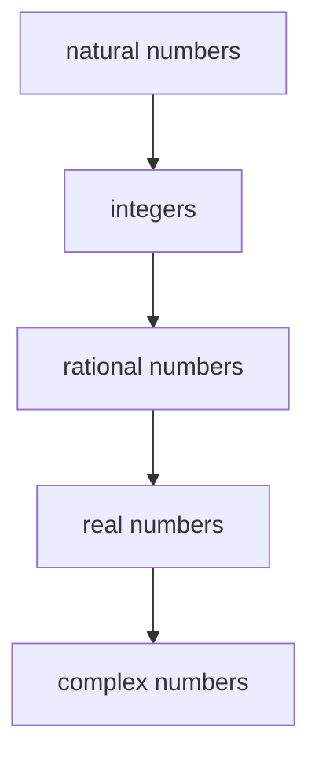

# Numbers

## Overview

A number is an abstract object used to count, measure, and label quantity. Numbers begin with the plain act of counting things, one, two, three, and grow into richer systems as new needs appear. When you need to record nothing, you get zero. When you need debts or directions, you get negatives. When you need parts of a whole, you get fractions. Each new kind of number answers a question the earlier kind could not.

Numbers matter because they are the vocabulary of all quantity and structure. The different kinds fit into nested systems, where each system contains the last and extends it. Naturals sit inside integers, integers inside rationals, rationals inside reals, and reals inside the complex numbers. The tension is that each extension solves a problem, such as taking a square root of a negative, while adding new behavior that you must learn to handle carefully.

### Quick Takeaways

- Numbers are abstract objects for counting, measuring, and labeling
- Number systems nest, each one containing and extending the previous
- Each extension is created to solve a problem the earlier system could not

## Definition

- **Natural number** is a counting number, starting at zero or one by convention.
- **Integer** is a whole number including negatives and zero.
- **Rational number** is a ratio of two integers with a nonzero denominator.
- **Irrational number** is a real number that cannot be written as such a ratio.
- **Real number** is any point on the continuous number line, rational or irrational.
- **Complex number** is a number of the form a plus b times the square root of minus one.

## The Analogy

Think of number systems as a set of nested measuring cups. The smallest cup handles simple counting. When a task overflows it, you pour into the next larger cup that can hold more kinds of value. Whole counts fit the small cup, debts and parts need bigger ones, and square roots of negatives need the largest. Each cup holds everything the smaller ones did plus more, so you never lose the earlier numbers when you move up.

## When You See It

- Counting objects with natural numbers in everyday life
- Recording temperatures below zero using negative integers
- Splitting a bill into fractions with rational numbers
- Measuring a diagonal or a circle, which needs irrational reals
- Solving equations whose answers require complex numbers
- Any coordinate, currency, or measurement that models a real quantity

## Examples

**Good:** Choosing the smallest number system that fits a problem, such as using integers for a bank balance that can go negative but never needs fractions.

**Bad:** Forcing every quantity into whole numbers, then being unable to express one third or the square root of two. The wrong system hides valid answers.

## Important Points

- Each larger system contains the smaller ones as a special case
- Zero and negative numbers were historically slow and hard to accept
- Rationals are dense, meaning one always sits between any two others
- Irrationals like pi and the square root of two fill the gaps in the line
- The reals form a continuous line with no holes, unlike the rationals
- Complex numbers make every polynomial equation solvable
- Beyond complex numbers lie further systems like quaternions with new trade-offs

## Summary

- Numbers are abstract objects for counting, measuring, and labeling quantity.
- The main systems nest from naturals up through integers, rationals, reals, and complex.
- Each extension answers a limitation of the system before it.
- Larger systems keep all earlier numbers while adding new capability.
- Choosing the right system keeps a problem both expressible and simple.
- _Each kind of number exists because a real question demanded it._
