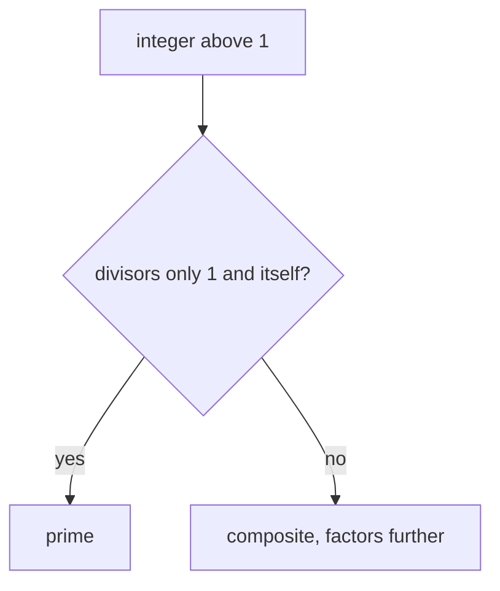
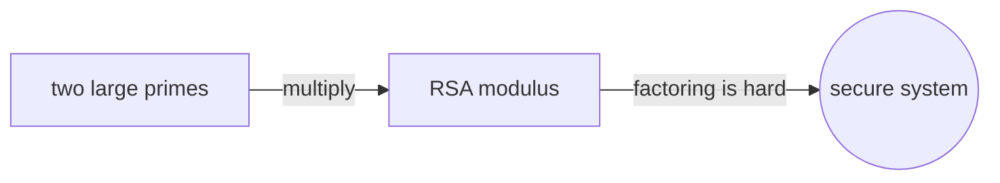

# Prime Numbers

## Overview

A prime number is an integer greater than one whose only positive divisors are one and itself. The first primes are two, three, five, seven, and eleven. Any integer above one that is not prime is composite, meaning it splits into a product of smaller factors. Primes are special because they cannot be broken down further by multiplication. They are the indivisible pieces from which every other integer is built.

Primes matter because they are the multiplicative atoms of the integers. The fundamental theorem of arithmetic says every integer above one is a unique product of primes, so understanding primes is understanding all integers. There are infinitely many of them, a fact known since Euclid, yet they grow scarcer and less predictable as numbers get large. This mix of infinite supply and irregular spacing is the central tension, and it is exactly what makes primes both mathematically deep and cryptographically useful.

### Quick Takeaways

- A prime is an integer above one with no divisors except one and itself
- Every integer above one is a unique product of primes
- Primes are infinite in number but thin out and spread irregularly

## Definition

- **Prime** is an integer above one divisible only by one and itself.
- **Composite** is an integer above one with at least one additional divisor.
- **Divisor** is an integer that divides another with no remainder.
- **Coprime** describes two integers whose only common divisor is one.
- **Twin primes** are a pair of primes that differ by exactly two.
- **Sieve of Eratosthenes** is a method that finds primes by crossing out multiples.

## The Analogy

Think of primes as indivisible LEGO bricks and composites as built structures. You can take any structure apart into bricks, but a single brick will not break into smaller bricks. Two is the brick you cannot split, six is a structure made from a two-brick and a three-brick. Every integer structure has one exact brick recipe. Primes are the pieces you cannot reduce, which is why they are the true units of multiplication.

## When You See It

- RSA and other public-key cryptography built on the hardness of factoring
- Hash tables that use prime sizes to spread keys evenly
- Random number generators using prime moduli
- Reducing fractions by canceling shared prime factors
- Error-correcting codes that exploit prime structure
- Any factorization problem, since primes are the endpoints of factoring

## Examples

**Good:** Choosing two large primes and multiplying them to form an RSA modulus. Recovering the primes from the product is hard, and that difficulty secures the system.

**Bad:** Treating one as a prime. If one counted as prime, factorizations would no longer be unique, which breaks the fundamental theorem of arithmetic.

## Important Points

- Two is the only even prime, since every other even number is divisible by two
- Euclid proved there are infinitely many primes with a short and elegant argument
- The prime number theorem gives the average density of primes near a large number
- Primality can be tested efficiently, but full factorization is believed to be hard
- Many patterns, such as twin primes, are conjectured but still unproven
- One is deliberately excluded so that unique factorization holds
- Primes appear irregularly, with both large gaps and close twin pairs

## Summary

- A prime is an integer above one divisible only by one and itself.
- Primes are the multiplicative atoms that build every integer uniquely.
- There are infinitely many primes, but they thin out as numbers grow.
- Testing primality is easy while factoring large numbers is hard.
- That gap in difficulty is the basis of modern public-key cryptography.
- _The simplest indivisible numbers still hide our hardest questions._
