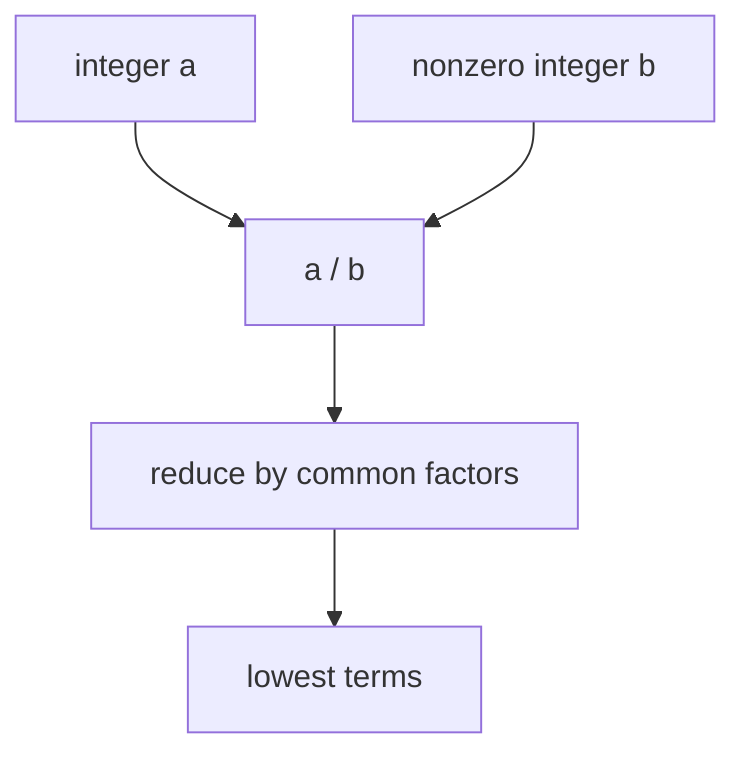
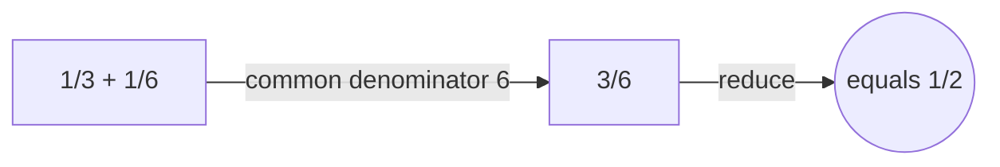

# Rational Numbers

## Overview

A rational number is any number that can be written as a ratio of two integers, a fraction with a whole-number top and a nonzero whole-number bottom. Examples are one half, three quarters, and seven, which is seven over one. Rationals arise the moment you need to divide a whole into equal parts. They fill the spaces between the integers with an endless supply of intermediate values.

Rationals matter because they make division almost always possible, something the integers cannot promise. They form a field, meaning you can add, subtract, multiply, and divide, apart from dividing by zero, and always land back among the rationals. They are also dense, so between any two rationals sits another. The tension is that despite being everywhere on the number line, the rationals still leave gaps. Numbers like the square root of two and pi are not rational, which is why the reals were needed.

### Quick Takeaways

- A rational number is a ratio of two integers with a nonzero denominator
- Rationals are closed under add, subtract, multiply, and divide except by zero
- They are dense yet still leave gaps that irrational numbers fill

## Definition

- **Rational number** is a value equal to a divided by b for integers a and b with b nonzero.
- **Numerator** is the integer on top of the fraction.
- **Denominator** is the nonzero integer on the bottom of the fraction.
- **Lowest terms** is the form where numerator and denominator share no common factor above one.
- **Density** is the property that a rational lies between any two distinct rationals.
- **Field** is a number system closed under the four operations, dividing by zero excluded.

## The Analogy

Think of rationals as pizza slices. A whole pizza is one, and cutting it into equal parts gives fractions like one third or five eighths. You can combine slices from differently cut pizzas by finding a common cut size, which is the common denominator. Any amount of pizza you can build from equal slices is a rational number. But a cut that would give exactly the square root of two of a pizza does not exist with equal slices, which is why some lengths are not rational.

## When You See It

- Splitting a bill or a recipe into equal shares
- Expressing probabilities as fractions of favorable to total outcomes
- Converting between units using ratios
- Representing exact values in computer algebra to avoid rounding
- Slopes and rates written as one quantity over another
- Any measurement recorded as a terminating or repeating decimal

## Examples

**Good:** Adding one third and one sixth by using a common denominator of six to get one half. The result stays rational and reduces to lowest terms cleanly.

**Bad:** Writing the square root of two as a fraction. No such fraction exists, and assuming one leads to a contradiction, which is the classic irrationality proof.

## Important Points

- Every rational has a decimal expansion that either terminates or repeats
- A repeating or terminating decimal can always be converted back to a fraction
- Reducing to lowest terms removes shared prime factors from top and bottom
- The rationals are countable, the same size of infinity as the integers
- They are dense, yet they have measure zero on the real line
- Division by zero is excluded because it has no consistent value
- The reals are the completion of the rationals, filling in the missing gaps

## Summary

- A rational number is a ratio of two integers with a nonzero denominator.
- Rationals support all four operations except dividing by zero.
- Their decimal forms always terminate or eventually repeat.
- They are dense on the line but still leave gaps for irrationals.
- The real numbers complete them by filling in those gaps.
- _Fractions cover much of the line, but not quite all of it._
