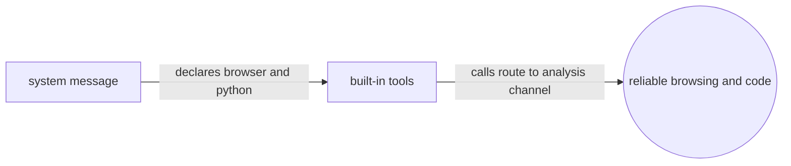
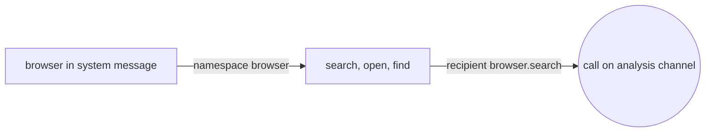
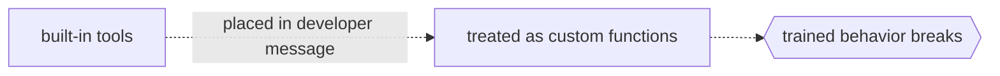

# Built-in Tools

## Overview

The `gpt-oss` models were trained with two built-in tools, a `browser` tool for fetching information and a `python` tool for running code during reasoning, and unlike your own functions these are declared in the system message, while their calls default to the `analysis` channel instead of `commentary`. If you want reliable browsing or code execution, match the trained format closely, because the model was shaped around these exact definitions.



### Quick Takeaways

- Built-in tools go in the system message, not the developer message
- Their calls default to the `analysis` channel
- Recipients are namespaced, such as browser dot search or plain python

## Definition

- **The browser tool** uses the `browser` namespace with the search, open, and find functions, and its recipients are browser dot search, browser dot open, and browser dot find.
- **The python tool** runs in a stateful Jupyter environment, executes code in the chain of thought, times out at 120 seconds, and can persist files at the mnt data path, while its recipient is always python.
- **The channel** for both tools defaults to `analysis`, though built-in tools occasionally use `commentary`.

## The Analogy

Your own functions are like freelancers you hire per project, described on a job sheet, which is the developer message. The built-in tools are like staff the model was raised with, already listed in the company handbook, which is the system message. The model knows their exact names and habits, so you describe them the way it was taught rather than however you like.

## When You See It

- Enabling web browsing or code execution for a self-hosted `gpt-oss`
- Parsing calls where the recipient is a browser function or python
- Routing built-in tool calls, which arrive on the `analysis` channel

## Examples

**Browser tool in the system message:**

```text
# Tools

## browser

// Tool for browsing.
namespace browser {

// Searches for information related to `query` and displays `topn` results.
type search = (_: {
query: string,
topn?: number, // default: 10
source?: string,
}) => any;

} // namespace browser
```



**Python tool description, kept to its original intent:**

```text
## python

Use this tool to execute Python code in your chain of thought. The code will not be shown
to the user. When you send a message containing Python code to python, it will be executed
in a stateful Jupyter notebook environment. python will respond with the output or time out
after 120.0 seconds. The drive at '/mnt/data' can be used to persist user files.
```



## Important Points

- Define built-in tools in the system message, not the developer message
- Browser and python calls default to the `analysis` channel
- The browser recipients are browser dot search, browser dot open, and browser dot find
- The python recipient is always python, running a stateful Jupyter session

## Common Mistakes

- Putting built-in tools in the developer message like custom functions
- Expecting built-in calls on `commentary`, when they default to `analysis`
- Renaming the namespaces, which breaks the trained behavior

## Summary

- Browser and python are trained-in tools declared in system, calling on the `analysis` channel.
- Keep their names and shapes exactly as the model was trained.
- _These tools are staff, not freelancers, so speak to them the way they were trained._
