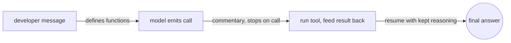
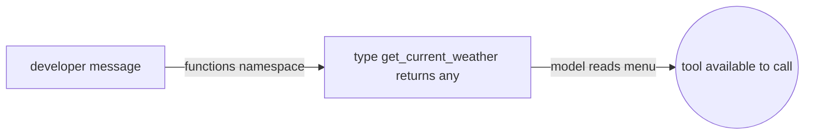
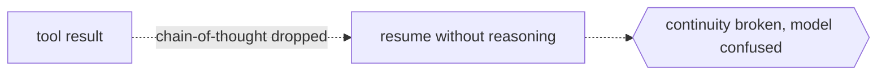

# Function Calling

## Overview

Harmony defines a formal tool-calling protocol where tools are declared in the developer message using a TypeScript-like syntax inside a `functions` namespace. When the model wants a tool, it emits a `commentary` message with a recipient and stops on the `<|call|>` token, then you run the tool, feed the result back, and resume inference. The round-trip has a subtle requirement, because you must pass the model own reasoning back together with the tool result, which is different from a normal turn.



### Quick Takeaways

- Tools are defined in the developer message under a Tools section
- A call names a recipient in the form to equals functions dot name on the `commentary` channel
- Pass the previous chain-of-thought back together with the tool output

## Definition

**Rules for defining a tool in the TypeScript-like syntax:**

- A tool with no arguments is written as a type that takes nothing and returns any.
- A tool with arguments names the single argument as an underscore and inlines the type.
- Descriptions go in a comment line directly above the field.
- The return type is always any.
- Keep an empty line after each function.
- Wrap everything in a `functions` namespace.

**The anatomy of a call is as follows:**

- The channel is `commentary` and the recipient is written as to equals functions dot name.
- An optional constrain token marks the argument data type, usually json.
- The message ends with the `<|call|>` token.

**Tool result format:**

```text
<|start|>{toolname} to=assistant<|channel|>commentary<|message|>{output}<|end|>
```

## The Analogy

It works like an order ticket at a kitchen, where the developer message is the menu of dishes the kitchen can make, which are the tool definitions. The model writes an order ticket addressed to one station, such as the weather function, and rings the bell with the call token, then the station cooks and returns a plate, which is the tool message. The chef then continues plating the full meal, which is the final answer, while still looking at the original order notes, which are the preserved chain-of-thought.

## When You See It

- Registering functions the model may call
- Parsing a call stop and dispatching the right function
- Resuming inference after collecting tool output

## Examples

**Defining a tool:**

```text
namespace functions {

// Gets the current weather in the provided location.
type get_current_weather = (_: {
// The city and state, e.g. San Francisco, CA
location: string,
format?: "celsius" | "fahrenheit", // default: celsius
}) => any;

} // namespace functions
```



**A tool call from the model:**

```text
<|channel|>analysis<|message|>Need to use function get_current_weather.<|end|><|start|>assistant<|channel|>commentary to=functions.get_current_weather <|constrain|>json<|message|>{"location":"San Francisco"}<|call|>
```

**Feeding the result back, where the chain-of-thought is kept:**

```text
...<|channel|>analysis<|message|>Need to use function get_current_weather.<|end|><|start|>assistant<|channel|>commentary to=functions.get_current_weather <|constrain|>json<|message|>{"location":"San Francisco"}<|call|><|start|>functions.get_current_weather to=assistant<|channel|>commentary<|message|>{"sunny": true, "temperature": 20}<|end|><|start|>assistant
```



## Important Points

- Tool calls ride the `commentary` channel, not the `analysis` channel
- The recipient can appear in the role or the channel section of the header
- Unlike normal turns, keep the previous chain-of-thought when passing tool output back
- A preamble is a user-visible commentary message written before multiple calls

## Common Mistakes

- Dropping the chain-of-thought before sending the tool result, which breaks continuity
- Forgetting the `functions` namespace, which causes name clashes with built-in tools
- Using a return type other than any in the definition

## Summary

- Declare tools in developer, and calls come back on `commentary` with a recipient.
- Feed the tool output together with the preserved chain-of-thought, then resume.
- _A tool call is a paused thought, so keep the scratch paper on the desk._
