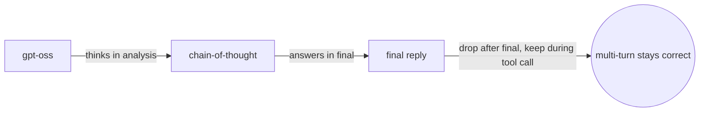
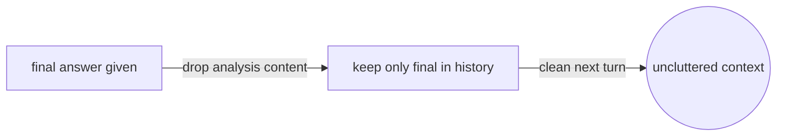
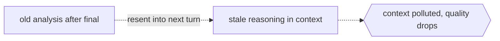

# Reasoning and Chain-of-Thought

## Overview

The `gpt-oss` models are reasoning models, so they think in the `analysis` channel and answer in the `final` channel. You control how hard they think with a reasoning effort setting, and you also decide whether to carry old reasoning into the next turn. The rule differs for plain answers versus tool calls, and this is where multi-turn correctness lives, because getting the chain-of-thought handling wrong will degrade the model.



### Quick Takeaways

- Reasoning effort is low, medium as the default, or high
- Raw chain-of-thought goes to the `analysis` channel, and the answer goes to `final`
- Drop old chain-of-thought after a final answer, but keep it during tool calls

## Definition

- **Reasoning effort** is set in the system message with a line such as Reasoning high, and it also accepts medium or low.
- **The analysis channel** carries the raw chain-of-thought, is held to a lower safety bar, and stays internal.
- **The dropping rule** means that if the last assistant turn ended in the final channel, you discard its analysis content before the next sampling.
- **The keeping rule** is the exception, because during tool calling you feed the previous chain-of-thought back so the model can continue its reasoning.

## The Analogy

The model is like a student solving a problem on scratch paper, where the scratch paper is the `analysis` channel and the boxed answer is the `final` channel, and once the answer is boxed the scratch paper is thrown away before the next question. If the student pauses mid-solution to look something up through a tool call, the scratch paper stays on the desk so they can pick up exactly where they left off.

## When You See It

- Building a multi-turn loop and deciding what history to resend
- Streaming reasoning tokens for internal logging, never for display
- Tuning cost versus quality with the reasoning level

## Examples

**Good, dropping chain-of-thought after a final answer:**

```text
<|start|>user<|message|>What is 2 + 2?<|end|>
<|start|>assistant<|channel|>final<|message|>2 + 2 = 4.<|end|>
<|start|>user<|message|>What about 9 / 2?<|end|>
<|start|>assistant
```

The prior analysis message is gone, and only the final answer is kept as history.



**Bad:** resending the old analysis chain-of-thought after a completed final answer.



## Important Points

- Default reasoning is medium if you set nothing
- The analysis channel is not safety-filtered like final, so never show it to users
- After a final answer, keep only the final text in history and drop the chain-of-thought
- During tool calling, the chain-of-thought must be preserved and passed back

## Common Mistakes

- Displaying or logging chain-of-thought to end users
- Dropping chain-of-thought mid tool call, which breaks the model continuity
- Carrying stale chain-of-thought forward after a final answer, which pollutes the context

## Summary

- Think in `analysis`, answer in `final`, and tune with reasoning effort.
- Drop chain-of-thought after final, and keep it during tool calls.
- _The scratch paper is thrown away after the answer, unless the pen never left the page._
