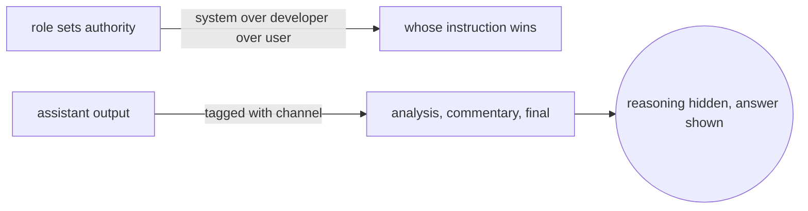
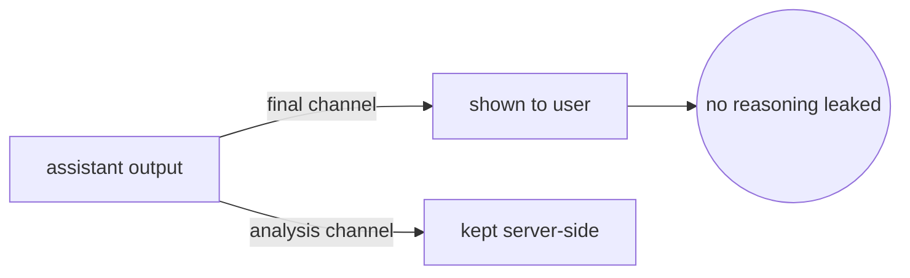
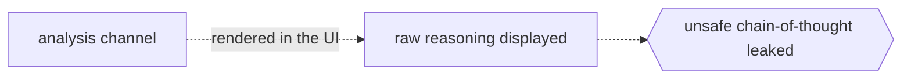

# Roles and Channels

## Overview

Every Harmony message carries a role, and the role decides who is speaking, and when instructions conflict it decides whose instruction wins. Assistant output adds a second axis called a channel, which splits internal reasoning from the answer shown to the user.

Get roles and channels right and the rest of Harmony falls into place, but get them wrong and you leak chain-of-thought to users or send tool calls to the wrong place.



### Quick Takeaways

- Five roles, ordered by authority
- Assistant output always names a channel
- The analysis channel is internal and must not be shown to users

## Definition

**Roles from highest to lowest authority:**

- **system** carries reasoning effort, meta info such as dates, and built-in tools.
- **developer** carries the real instructions and the function tools.
- **user** carries the input to the model.
- **assistant** carries model output as either a message or a tool call, tagged with a channel.
- **tool** carries the output of a tool call, and the tool name is used as the role.

**Instruction hierarchy:** system, then developer, then user, then assistant, then tool.

**Channels used by the assistant:**

- **final** is the answer shown to the end user.
- **analysis** is the chain-of-thought, internal, held to a lower safety bar, and must not be displayed.
- **commentary** carries function tool calls and preambles, and it is usually shown to the user.

## The Analogy

Roles are ranks in a chain of command, and a higher rank overrides a lower one when orders clash. Channels are like a worker notepad versus their final report, where the analysis channel is the scratch notepad that is messy and unfiltered, the final channel is the polished report handed to the client, and the commentary channel is the sticky note that announces a supplier is about to be called.

## When You See It

- Deciding where an instruction belongs, meta config versus the actual prompt
- Filtering model output so users never see the analysis channel
- Routing tool calls, which ride on commentary for functions

## Examples

**Good:** show the final channel to users and keep analysis server-side for logging only.



**Bad:** render the analysis channel in the UI, which exposes raw and possibly unsafe reasoning.



**Channel in raw output:**

```text
<|channel|>analysis<|message|>User asks 2 + 2. Simple.<|end|>
<|start|>assistant<|channel|>final<|message|>2 + 2 = 4.<|return|>
```

## Important Points

- The tool role uses the tool name, not the literal word tool
- The analysis channel is not trained to the same safety standard as final
- Function calls default to commentary, and built-in tools default to analysis
- Preambles are commentary messages that are meant to be user-visible

## Common Mistakes

- Displaying chain-of-thought to end users
- Putting the actual prompt in system instead of developer
- Assuming every assistant message is a final answer

## Summary

- Roles set authority, and channels split reasoning from the answer.
- Never surface the analysis channel to users.
- _Rank decides who wins, and channel decides what the user is allowed to see._
