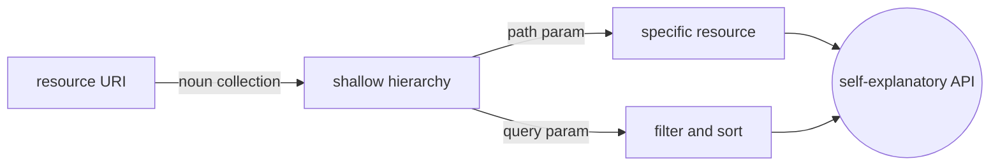

# URI Design

## Overview

Good URI design makes APIs self-explanatory. You should infer resource meaning without opening docs for every endpoint.

URI naming is a small decision with large maintenance impact.



### Quick Takeaways

- Use nouns for resources
- Keep path hierarchy shallow and predictable
- Use query params for filtering and sorting

## Definition

URI design in REST means:

- using nouns for resources
- using consistent hierarchy
- using predictable path patterns

## The Analogy

Think of city addresses:

- district -> collection
- street number -> specific resource
- zoning rules -> naming conventions

If addresses are random, delivery fails even with perfect roads.

## When You See It

You apply URI design on:

- collection endpoints
- nested relations
- versioning prefix
- filtering through query params

## Examples

**Good:**

- `/v1/users/{userId}/sessions`

```mermaid
flowchart LR
  Users[/v1/users collection] -->|userId path param| User[one user]
  User -->|nested noun| Sessions[/sessions collection]
  Sessions --> Readable((self-documenting path))
```

**Bad:**

- `/v1/getUserSessionListById`

```mermaid
flowchart LR
  Verb[/v1/getUserSessionListById] -.->|action in path| Opaque[meaning hidden in name]
  Opaque -.->|no hierarchy| Read[reader must open docs]
  Read -.-> Broken{{unpredictable URI surface}}
```

**Good snippet (resource-first):**

Resource-first URI with query parameters:

```http
GET /v1/users/42/sessions?limit=20&offset=0
```

**Bad snippet (action-first):**

Action-first URI violates REST principles:

```http
POST /v1/getUserSessionListById
```

## Important Points

- Prefer plural nouns for collections (`/users`, `/prompts`)
- Use path params for identity, query params for filtering
- Keep depth reasonable, avoid path chains longer than needed
- Use lowercase kebab-case when possible for readability

## Query Parameter Rules

- Use query params for filter, sort, search, pagination
- Keep parameter names stable across resources where possible
- Avoid encoding business actions into query strings

**Good:**

- `/v1/prompts?category=saas&type=hero&limit=20&offset=0`

**Bad:**

- `/v1/prompts?doDelete=true`

## Summary

- URI design is interface UX for developers.
- Consistent paths reduce support and integration friction.
- _Readable paths are cheaper than clever endpoint names._
