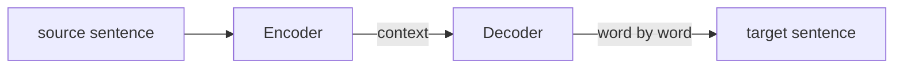
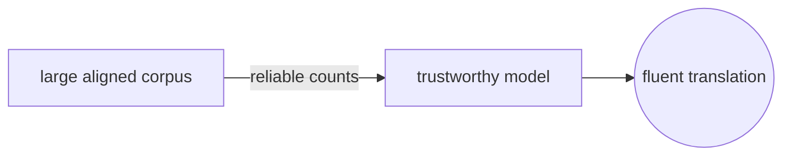
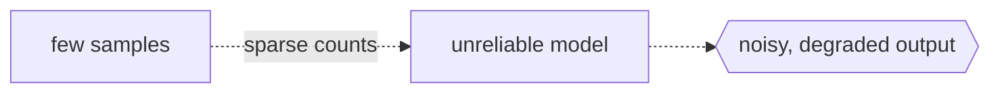

# Structure

> Reference: [kyong0612 learning-notes](https://github.com/kyong0612/learning-notes/tree/main/articles) (example: [Claude Code CLAUDE.md](https://github.com/kyong0612/learning-notes/blob/main/articles/Claude%20Code%20%E3%81%AE%20CLAUDE.md%E3%81%AF%E8%A8%AD%E5%AE%9A%E3%81%97%E3%81%9F%E6%96%B9%E3%81%8C%E3%81%84%E3%81%84/note.md))

- One file holds one topic or one source
- Frontmatter plus a structured body, and the body starts with an H1 that is the note title

## 1. Frontmatter (YAML)

```yaml
---
title: 'Note title (representative)'
source: 'Reference URL'
description: 'One or two sentences: what it covers and the main takeaway.'
tags: ['tag1', 'tag2']
---
```

- **title**: Title used in the note (usually same as or a summary of the source).
- **source**: One clickable URL.
- **description**: Short summary for quick scan.
- **tags**: For filtering and navigation. Inline array or multi-line list (as in Time-Complexity) both valid.

## 2. Body Structure

**First line of body:** `# Note Title` (H1, same or close to `title` in frontmatter). Kyong always uses this, we follow.

Two patterns:

### Pattern A: Article / Talk Summary (Kyong Style)

Follow the source flow. Not rigid Definition/Analogy/Examples.

- **## はじめに** (or **## Overview** / intro): context, why this topic, what changed for the author.
- **## [Topic 1]**, **## [Topic 2]**, …: sections follow the article/talk structure. Use **###** for subsections.
- Lists, code blocks (```), **bold** for important terms.
- **## まとめ** (or **## Summary**): summary, end with **結論:** or one takeaway sentence (italic allowed).

Real flow example: [note Claude Code CLAUDE.md](https://github.com/kyong0612/learning-notes/blob/main/articles/Claude%20Code%20%E3%81%AE%20CLAUDE.md%E3%81%AF%E8%A8%AD%E5%AE%9A%E3%81%97%E3%81%9F%E6%96%B9%E3%81%8C%E3%81%84%E3%81%84/note.md), where the flow runs はじめに, CLAUDE.mdとは, ワークフロー, TDD, ツール, and on to まとめ with 結論.

### Pattern B: Concept Note

One concept per file, fixed sections. Optional extra sections (for example a deeper dive) are allowed.

- **## Overview**: one or two paragraphs, what this note is about and the main point. End with one **mermaid** diagram that shows the concept (see section 7).
- **## Definition** (if needed): formal definition or term boundaries.
- **## The Analogy**: real-world analogy.
- **## When You See It**: when this pattern appears (code, algorithm, context).
- **## Examples**: concrete examples, label **Good:** / **Bad:** (or **Better:** / **Good to know:** as needed). The first **Good:** and **Bad:** each get a **mermaid** diagram below them (see section 7).
- **## Important Points**: key points (bullets).
- **## Summary**: summary (bullets) with one closing italic sentence (NeaByte style).

## 3. Writing Style

| Aspect          | Rule                                                                       |
| --------------- | -------------------------------------------------------------------------- |
| **Density**     | Short sentences, one idea per sentence. Avoid filler.                      |
| **Punctuation** | Use periods, commas, colons. Avoid excessive em dash, use commas instead.  |
| **Examples**    | **Good:** / **Bad:** (text only, no emoji).                                |
| **Diagrams**    | Mermaid required: one in Overview, one under the first Good and first Bad. |
| **Closing**     | One italic sentence, direct and humble.                                    |

## 4. File Naming

- Actual file: **lowercase**, kebab-case. Examples: `o-1-constant.md`, `o-n-squared-quadratic.md`.
- In README/index: link to the actual file name (lowercase). Current practice: use lowercase in the table.

## 5. Checklist (per note)

**General:**

1. Frontmatter: title, source, description, tags.
2. Body starts with **# Note Title** (H1).
3. Save with lowercase kebab-case file name.

**Pattern A (Article Summary):** intro, then sections that follow the source, then まとめ with 結論.

**Pattern B (Concept):** Overview with mermaid, then Definition, then The Analogy, then When You See It, then Examples with a mermaid on the first Good and the first Bad, then Important Points, then Summary with an italic sentence.

## 6. Minimal Template (Pattern B: Concept)

```markdown
---
title: 'Note Title'
source: 'https://...'
description: 'One sentence: what it covers and the main point.'
tags: ['tag1', 'tag2']
---

# Note Title

## Overview

[One or two paragraphs: what this note is about, main point.]

[mermaid: flowchart giving a visual overview of the concept]

## Definition

[Formal definition or term boundaries.]

## The Analogy

[Real-world analogy.]

## When You See It

[When this pattern appears.]

## Examples

**Good:** [example]

[mermaid: flowchart showing the good path working]

**Bad:** [counter-example]

[mermaid: flowchart showing the bad path failing]

## Important Points

- Point 1
- Point 2

## Summary

- Short summary.
```

## 7. Mermaid Diagrams

Series index files may include one Mermaid diagram to show relationships between notes. Every Pattern B note has three mermaid diagrams. One in the Overview, two in Examples. Each one shows the shape of the idea before the text explains it.

**Where they go:**

- **Overview (1 diagram):** after the Overview paragraphs, before `### Quick Takeaways` if present. Show the main pieces and how they connect.
- **Examples (2 diagrams):** one under the first `**Good:**` line, one under the first `**Bad:**` line. Later pairs stay text only.

**Rules:**

- Default to `flowchart LR`. Switch type, for example `stateDiagram`, only when it fits the concept better.
- Keep it to three to six nodes. Sketch the idea, do not draw the full model.
- Label edges so they carry meaning, for example `A -->|0.6| B` or `Source -->|action| Next`.
- **Good** diagrams use solid arrows, `-->`, for the working path.
- **Bad** diagrams use dashed arrows, `-.->`, for the broken path, and end in a `{{...}}` node that names the failure.
- Keep node text plain, no emoji. Use `((...))` for an outcome, `{{...}}` for a warning or failure.

**Overview example:**



**Examples, Good:**



**Examples, Bad:**


