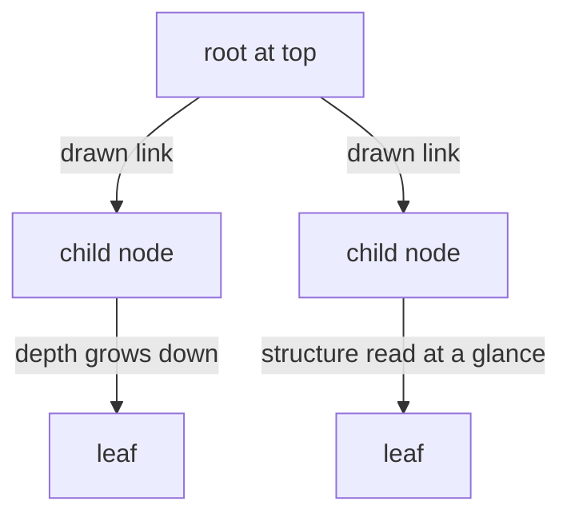
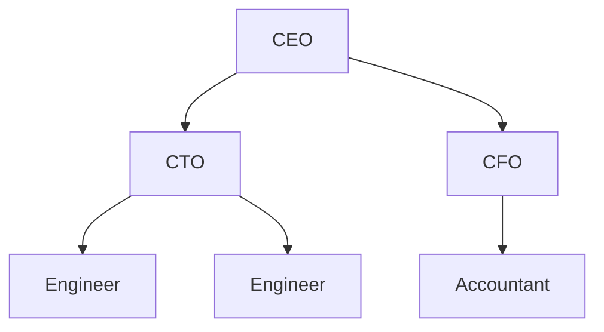
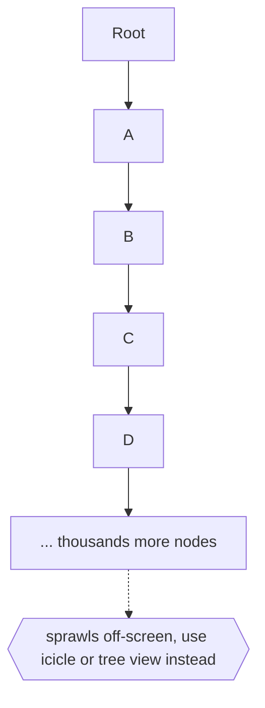

# Classical Node-Link Diagrams

## Overview

A classical node-link diagram is the most familiar way to draw a tree. Each node is a shape, usually a box or circle, and each parent-child relationship is an explicit line connecting two nodes. The root sits at the top, children hang below their parents, and depth increases as you move down. This layout maps the abstract idea of hierarchy directly onto the page, so anyone can trace the path from any node back to the root by following the links.

The strength of node-link diagrams is clarity of structure. Relationships are drawn, not implied, so parent, child, sibling, and ancestor are all read at a glance. The weakness is space. As a tree grows wide or deep, the drawing spreads out and wastes area, and large trees quickly overflow the screen. This is why alternative layouts like icicle, radial, and nested representations exist, each trading some of this directness for better use of space. But when a tree is small to medium, the node-link diagram remains the clearest choice.

### Quick Takeaways

- Nodes are shapes and every parent-child link is drawn as an explicit connecting line
- The root is placed at the top and depth grows downward, making hierarchy easy to read
- It is the clearest layout for small trees but wastes space as the tree grows large

## Definition

- **Node** is a drawn shape representing one element of the tree.
- **Link** is a line connecting a parent node to one of its child nodes.
- **Root** is the topmost node with no parent, the anchor of the layout.
- **Leaf** is a node with no children, drawn at the bottom of its branch.
- **Depth** is the number of links from the root down to a given node.
- **Layout** is the algorithm that assigns positions so nodes and links do not overlap.

## The Analogy

Think of a family tree pinned on a wall. Grandparents sit at the top, their children below, grandchildren below that, and a line is drawn between each parent and child. You never have to guess who descends from whom because the lines say it directly. Tracing your own ancestry is just following the lines upward. A classical node-link diagram is exactly this family tree, generalized to any hierarchy.

## When You See It

- Organization charts showing who reports to whom in a company
- File managers and IDEs drawing folder and file hierarchies
- Family trees and genealogy tools
- Syntax trees and parse trees in compilers and linguistics
- Decision trees and flow diagrams in analysis tools
- Mind maps and concept diagrams that branch from a central idea

## Examples

**Good:** Drawing a company org chart with fifteen people as a node-link diagram. Each reporting line is explicit, and anyone can trace their chain of command up to the CEO at a glance.

**Bad:** Using a node-link diagram to show a file system with thousands of deeply nested folders. The drawing sprawls far beyond the screen and becomes impossible to navigate.

## Important Points

- Links are explicit, so every relationship is drawn rather than inferred
- Readability is excellent for small trees but degrades as width and depth grow
- Layout algorithms like Reingold-Tilford compute tidy, non-overlapping positions
- Orientation can be top-down, left-right, or bottom-up without changing the structure
- Space efficiency is poor, which motivates icicle, radial, and nested alternatives
- It shows topology well but not quantitative attributes like subtree size
- It is the default mental model most people have for the word "tree"

## Summary

- A classical node-link diagram draws nodes as shapes and every parent-child link as a line.
- The root sits on top and depth grows downward, making hierarchy immediately readable.
- It is the clearest layout for small to medium trees.
- It wastes space and overflows for large or deep trees.
- Alternatives like icicle and radial layouts trade directness for better space use.
- _Draw the lines and the hierarchy explains itself, at least until the tree outgrows the page._
