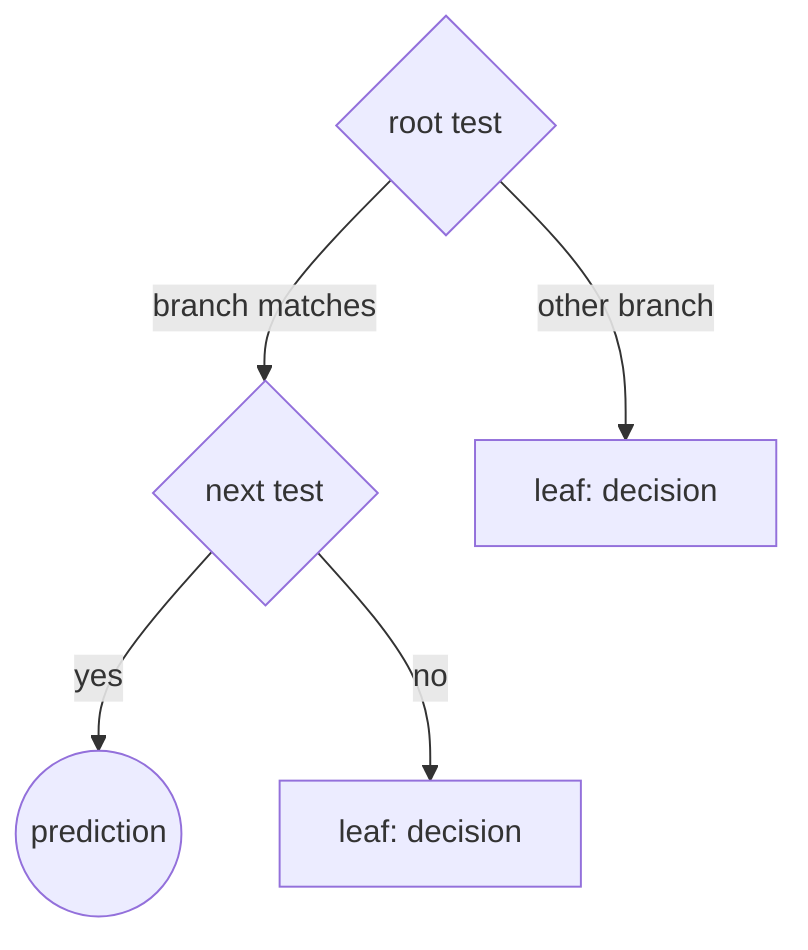
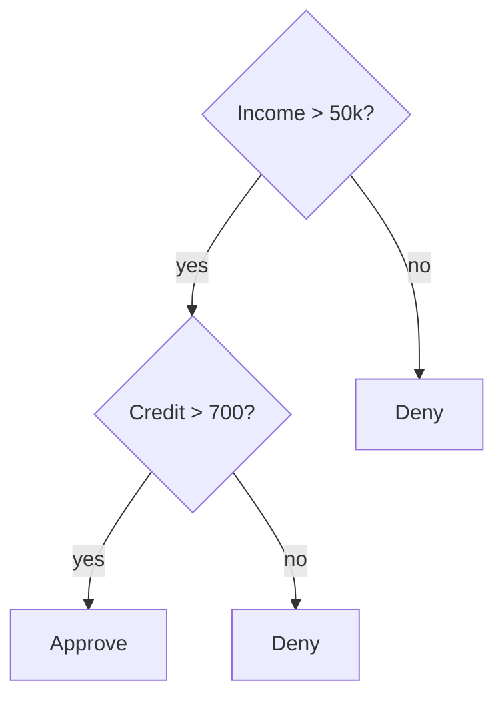
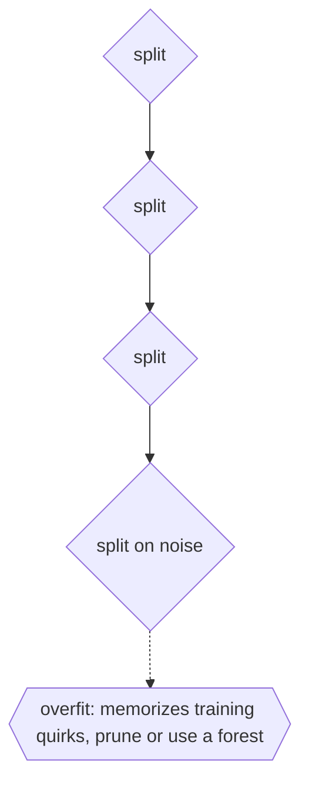

# Decision Tree

## Overview

A decision tree is a tree whose internal nodes ask questions and whose leaves give answers. You start at the root, evaluate the condition there, and follow the branch matching the result. You repeat this at each node until you reach a leaf, which holds the decision or prediction. Because every input follows exactly one path from root to leaf, the tree turns a complex decision into a short sequence of simple tests. This makes decision trees both a manual decision aid and a core machine learning model.

In machine learning, decision trees are learned from data. An algorithm picks, at each node, the feature test that best separates the examples, using a criterion like information gain or Gini impurity, and recurses on the resulting subsets. The result is highly interpretable: you can read off exactly why a prediction was made by following its path. The weakness is overfitting, since a deep tree can memorize noise, which is why trees are pruned or combined into ensembles like random forests and gradient boosting. As a plain decision aid, the same structure encodes expert rules as a readable flow of yes/no questions.

### Quick Takeaways

- Internal nodes test conditions and leaves hold the final decision or prediction
- Every input follows one root-to-leaf path, turning a decision into simple sequential tests
- Trees are interpretable but overfit easily, so they are pruned or combined into ensembles

## Definition

- **Root** is the first condition tested, where every path begins.
- **Internal node** is a node holding a test on one feature or attribute.
- **Branch** is an outcome of a test leading to a child node.
- **Leaf** is a terminal node holding a class label, value, or decision.
- **Splitting criterion** is the measure, like information gain or Gini, used to choose tests.
- **Pruning** is removing weak branches to reduce overfitting and simplify the tree.

## The Analogy

Think of a medical triage flowchart. "Is the patient breathing? If yes, ask the next question, if no, act immediately." Each answer sends you down a branch to the next question until you reach an action. A nurse does not weigh everything at once, they follow a chain of simple checks to a clear outcome. A decision tree is exactly that triage flowchart, whether written by an expert or learned from data.

## When You See It

- Classification and regression models in machine learning
- Random forests and gradient-boosted trees as building blocks
- Credit scoring and risk assessment with readable rules
- Medical and troubleshooting flowcharts encoding expert logic
- Rule engines that route inputs through nested conditions
- Any decision needing a transparent, step-by-step justification

## Examples

**Good:** Using a shallow, pruned decision tree for loan approval. Each prediction traces a short path of clear conditions, so the reason for approval or denial is fully transparent.

**Bad:** Growing a single decision tree very deep until it perfectly fits the training data. It memorizes noise, splits on meaningless quirks, and generalizes poorly to new cases.

## Important Points

- Internal nodes test features, leaves give the answer, each input takes one path
- Learning greedily picks the best split at each node by an impurity or gain measure
- Interpretability is a key strength, the path explains the prediction
- Deep unpruned trees overfit by memorizing noise in the training data
- Pruning and depth limits trade a little accuracy for better generalization
- Ensembles like random forests and boosting fix single-tree instability
- The same structure serves both learned models and hand-authored decision logic

## Summary

- A decision tree routes an input through condition tests to a leaf that gives the answer.
- Each input follows exactly one root-to-leaf path, making decisions transparent.
- In machine learning, splits are chosen to best separate the data.
- Single trees overfit easily, so they are pruned or combined into ensembles.
- The same structure encodes both learned predictions and expert rule flows.
- _Ask a few sharp questions in order and the branch you land on is your answer._
