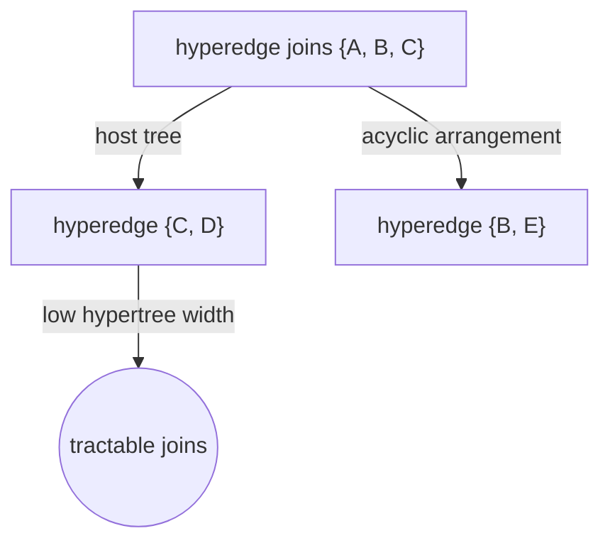
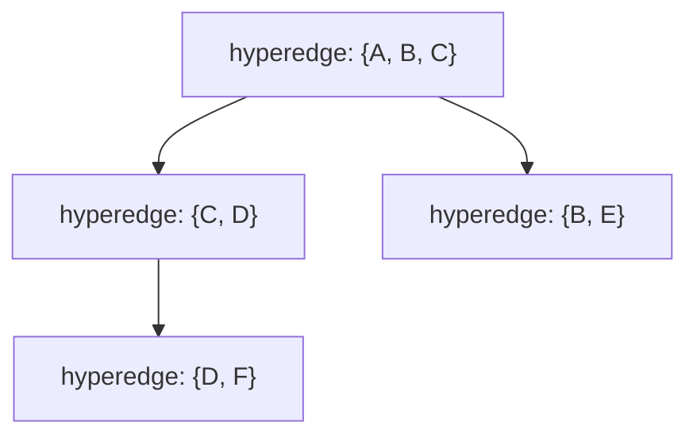
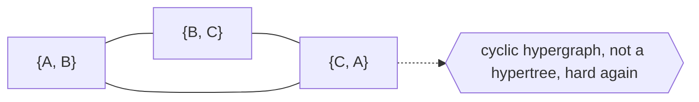

# Hypertree

## Overview

A hypertree generalizes a tree from ordinary edges to hyperedges. In a normal tree, each edge joins exactly two nodes. In a hypergraph, an edge, called a hyperedge, can join any number of nodes at once. A hypertree is a hypergraph that still has a tree-like, acyclic organization despite these multi-node edges. Formally it is tied to the idea of a tree decomposition: the hyperedges can be arranged into a host tree so that the structure has no genuine cycles. This keeps the good properties of trees while allowing richer, many-to-many groupings.

Hypertrees matter because many real relationships are not pairwise. A single database constraint may involve several columns, a single reaction may involve several molecules, a single meeting may involve several people. Modeling these as hyperedges is more faithful than forcing them into pairs. When such a hypergraph is acyclic in the hypertree sense, hard problems become tractable: constraint satisfaction and database join queries that are NP-hard in general can be solved efficiently when they have low "hypertree width." So the hypertree is both a structural idea and a key to efficient computation. Note the name is also used separately for a radial tree visualization in hyperbolic space, a different meaning.

### Quick Takeaways

- A hyperedge can connect many nodes at once, generalizing the two-node edges of a tree
- A hypertree is a hypergraph that stays acyclic and tree-organized despite multi-node edges
- Low hypertree width makes otherwise hard constraint and join problems efficiently solvable

## Definition

- **Hypergraph** is a graph whose edges may each connect any number of nodes.
- **Hyperedge** is a single edge joining a set of nodes rather than just two.
- **Acyclic hypergraph** is a hypergraph with no genuine cycles in the hypertree sense.
- **Tree decomposition** is an arrangement of the structure onto a host tree of node clusters.
- **Hypertree width** is a measure of how close a hypergraph is to being a tree.
- **Host tree** is the underlying tree onto which hyperedges are organized.

## The Analogy

Think of committees in an organization. A normal tree edge is like a one-on-one reporting line between two people. A hyperedge is like a committee, one relationship that binds several people together at once. If you can arrange all the committees so they nest neatly without tangled overlaps, the whole organization still reads like a tidy tree even though each committee touches many members. That tidy arrangement of many-member groups is a hypertree.

## When You See It

- Database theory, where acyclic join queries are evaluated efficiently
- Constraint satisfaction problems solved fast when hypertree width is low
- Modeling relationships that inherently involve more than two entities
- Chemical reaction networks joining several reactants and products
- Probabilistic graphical models and their junction trees
- Any many-to-many structure you want to keep tree-tractable

## Examples

**Good:** Modeling a database join query whose relations form an acyclic hypergraph. Because it is a hypertree, the query is evaluated efficiently even though each relation spans several attributes.

**Bad:** Assuming any hypergraph with multi-node edges is a hypertree. If the hyperedges form real cycles, hypertree width is high and the efficient algorithms no longer apply.

## Important Points

- A hyperedge joins many nodes, unlike the strictly binary edges of a plain tree
- A hypertree is the acyclic, tree-organized case of a hypergraph
- Acyclicity here is defined through tree decompositions, not simple cycle checks
- Low hypertree width makes constraint and join problems tractable
- It faithfully models relationships that are inherently many-to-many
- Junction trees in graphical models are a closely related construction
- The name also refers separately to a hyperbolic radial tree visualization

## Summary

- A hypertree generalizes a tree by allowing hyperedges that join many nodes at once.
- It remains acyclic and tree-organized, tied to the notion of tree decomposition.
- It models many-to-many relationships more faithfully than pairwise edges.
- Low hypertree width turns hard constraint and join problems tractable.
- Beware the separate use of the name for a hyperbolic tree visualization.
- _Let one edge bind a whole committee, and if the committees nest cleanly, it is still a tree._
