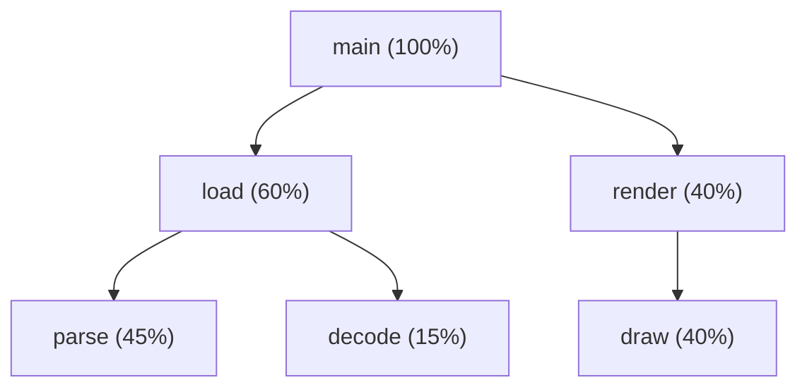
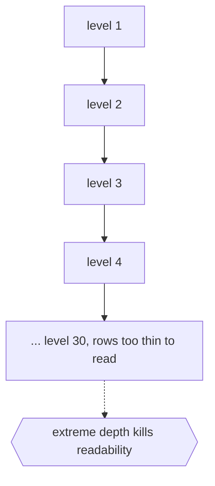

# Layered "Icicle" Diagrams

## Overview

An icicle diagram draws a tree as stacked bars instead of nodes and lines. Each level of the hierarchy is a row (or column), and each node is a rectangle in that row. A child's rectangle sits directly under its parent's rectangle and never extends beyond the parent's width. The result looks like rows of icicles hanging down, hence the name. Unlike a node-link diagram, there are no explicit connecting lines. Containment and alignment carry the parent-child relationship instead.

The big advantage is space efficiency and the ability to encode quantity. Because rectangles fill the space, the length of a node's bar can represent the size of its subtree, the number of files in a folder, or any weight. This turns the layout into a data visualization, not just a structure drawing. The tradeoff is that deep hierarchies produce many thin rows that get hard to read, and precise ancestor tracing is less immediate than following drawn lines. Icicle diagrams and their radial cousin, the sunburst, are popular for showing where space or time is spent in a hierarchy.

### Quick Takeaways

- Nodes are stacked rectangles per level, with children constrained under their parent's width
- Bar length can encode subtree size or weight, turning structure into quantitative data
- It is far more space-efficient than node-link but harder to read when very deep

## Definition

- **Level** is one row or column of the layout holding all nodes at a given depth.
- **Rectangle** is the bar representing a single node, sized by its weight or subtree.
- **Containment** is the rule that a child's bar fits within the horizontal span of its parent.
- **Weight** is the quantity a bar's length encodes, such as file count or duration.
- **Sunburst** is the radial version of an icicle, with levels drawn as concentric rings.
- **Space-filling** means the layout uses the full drawing area with no blank gaps between nodes.

## The Analogy

Think of a stacked bar chart that also nests. The top bar is the whole budget. The row below splits that bar into departments, each as wide as its share. The next row splits each department into projects, still confined under its department's width. You see both the hierarchy and how the total divides up, all without a single connecting line. That nested, proportional stack is an icicle diagram.

## When You See It

- Profiling tools showing where CPU time is spent across a call stack (flame graphs)
- Disk usage explorers showing which folders consume the most space
- Website analytics showing navigation paths and their volumes
- Budget and portfolio breakdowns by category and subcategory
- Any hierarchy where subtree size or weight is the main question
- Sunburst dashboards summarizing nested categorical data

## Examples

**Good:** Using an icicle (flame graph) to profile a program, where each bar's width is time spent in that function. Wide bars instantly reveal the hot paths worth optimizing.

**Bad:** Using an icicle diagram for a tree that is thirty levels deep. The rows become hair-thin, labels vanish, and tracing a single path down is nearly impossible.

## Important Points

- No connecting lines, containment and alignment express the parent-child relationship
- Bar length is free to encode weight, making it a quantitative visualization
- Space-filling layouts use the whole canvas, unlike sparse node-link drawings
- The sunburst is the same idea drawn as concentric rings around a center
- Very deep trees produce thin, unreadable rows, its main weakness
- Reading exact structure is less direct than following explicit links
- Flame graphs are the best-known applied form, used for performance profiling

## Summary

- An icicle diagram stacks nodes as nested rectangles, one level per row.
- Containment replaces drawn links to express hierarchy compactly.
- Bar length can encode subtree size or weight, adding a quantitative dimension.
- It is highly space-efficient and excels at showing where weight concentrates.
- Deep hierarchies make its rows too thin to read, its key limitation.
- _No lines needed, the bars nest inside each other and the proportions tell the story._
