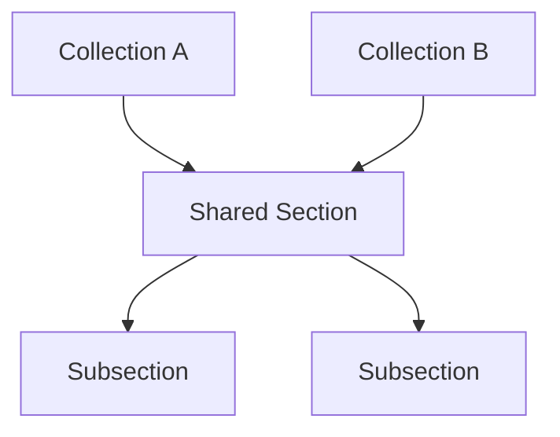
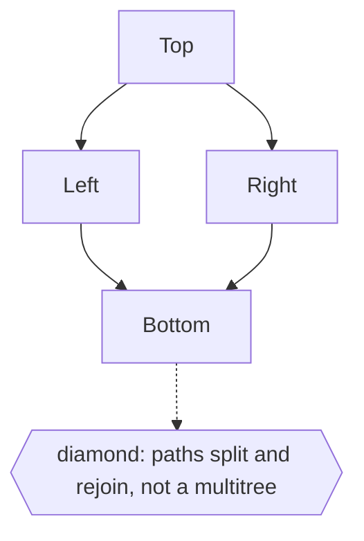

# Multitree

## Overview

A multitree is a directed acyclic graph with a special restriction: for every node, the set of nodes reachable from it (its descendants) forms a tree, and equivalently the set of nodes that can reach it (its ancestors) forms a tree. In plain terms, a node may have several parents, so subtrees can be shared, but you can never reach the same node by two different downward paths that split and rejoin. This forbids "diamond" shapes. A multitree sits between a strict tree, where each node has one parent, and a general DAG, where anything goes.

The value of a multitree is that it allows sharing without ambiguity. Because the ancestors of any node form a tree, there is always a clean, tree-like view from any node's perspective, even though the whole structure is not a tree. This is useful for representing overlapping hierarchies where the same item legitimately belongs under multiple parents, yet you still want each item's lineage to be unambiguous. Multitrees are also called strongly unambiguous graphs or diamond-free posets, and they appear in inheritance systems, category overlaps, and version histories that branch and share but never merge into diamonds.

### Quick Takeaways

- A node may have multiple parents, so subtrees can be shared across the structure
- No two distinct downward paths may split and rejoin, so diamond shapes are forbidden
- The ancestors of every node form a tree, giving each node an unambiguous lineage

## Definition

- **Directed acyclic graph** is a graph with directed edges and no directed cycles.
- **Multiple parents** means a node can be a child of more than one parent.
- **Shared subtree** is a subtree reachable from several parents at once.
- **Diamond** is a forbidden pattern where two paths split and later rejoin at one node.
- **Ancestor tree** is the requirement that each node's ancestors form a tree.
- **Diamond-free** is the equivalent name for the multitree restriction.

## The Analogy

Think of quoting the same paragraph in several different documents. Many documents (parents) can point to and share that one paragraph (a shared subtree), which saves duplication. But you never allow two chains of quoting to split apart and then merge back into the exact same later paragraph, because that would make its origin ambiguous. Sharing upward is fine, tangled rejoining is not. That disciplined sharing is a multitree.

## When You See It

- Class inheritance hierarchies that allow shared bases but forbid ambiguous diamonds
- Category systems where an item belongs under several parents cleanly
- Version and document histories that branch and reuse without merging into diamonds
- Build and dependency graphs where components are shared but lineage stays clean
- Overlapping taxonomies that need unambiguous ancestry per node
- Any DAG where you want tree-like lineage despite multiple parents

## Examples

**Good:** Modeling a document library where several collections share the same reusable section. Each collection points to the shared section, and every section still has a clean, tree-shaped set of ancestors.

**Bad:** Treating a graph with a diamond as a multitree. When two paths from one node split and rejoin at another, the ancestor set is no longer a tree and the multitree property is violated.

## Important Points

- A multitree is a DAG where each node's ancestors (and descendants) form a tree
- Multiple parents are allowed, enabling shared subtrees without duplication
- The defining ban is on diamonds, split-then-rejoin paths are forbidden
- It sits strictly between a plain tree and a general DAG in generality
- Every node still has an unambiguous, tree-shaped lineage
- Also known as a diamond-free poset or strongly unambiguous graph
- It suits overlapping hierarchies that must keep clean ancestry

## Summary

- A multitree is a DAG in which every node's ancestors form a tree.
- Nodes may have several parents, so subtrees can be shared.
- Diamonds, where paths split and rejoin, are forbidden.
- It sits between a strict tree and a general DAG.
- It gives unambiguous lineage while still allowing reuse.
- _Share a branch under many parents freely, just never let two paths split and meet again._
