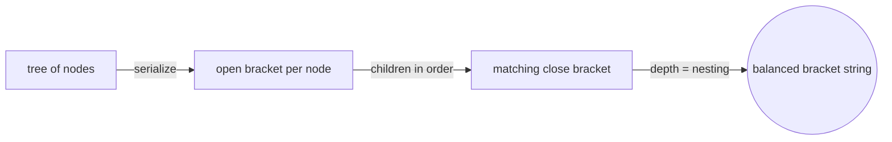
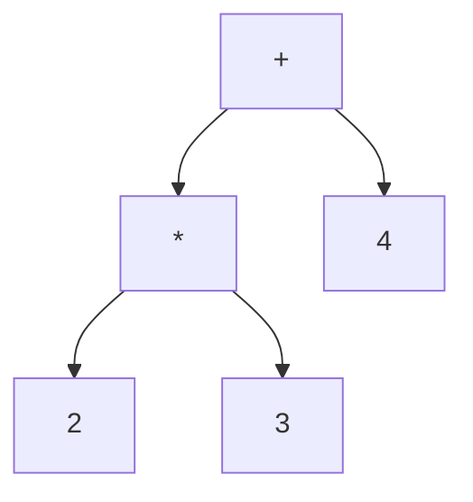
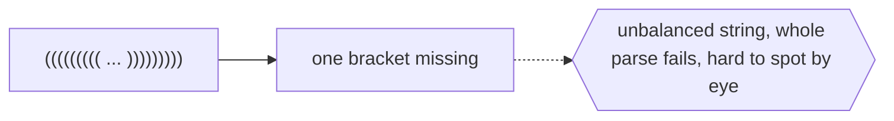

# Nested Parentheses

## Overview

Nested parentheses encode a tree as a flat string of balanced brackets. Each node is written as an opening bracket, its children in order, then a closing bracket. The depth of nesting in the string is exactly the depth of the node in the tree. Because the brackets must balance, a parenthesis string is a fully faithful, one-dimensional serialization of a hierarchy. No coordinates, pointers, or separate structure are needed, the punctuation alone carries the entire shape.

This representation is how hierarchy lives inside text and code. Nested function calls, S-expressions in Lisp, JSON and XML nesting, and mathematical grouping all rely on balanced brackets to express tree structure linearly. Its great advantages are compactness and that it is plain text, easy to store, transmit, and parse. The tradeoff is human readability at depth: counting many nested closing brackets is error-prone, which is exactly why editors add bracket matching and indentation. Underneath, though, the string and the tree are the same object.

### Quick Takeaways

- A tree becomes a flat string where nesting depth equals depth in the hierarchy
- Balanced brackets alone carry the full structure, no pointers or coordinates needed
- It is compact and text-native but hard to read by eye when deeply nested

## Definition

- **Opening bracket** marks the start of a node and increases the current depth.
- **Closing bracket** marks the end of a node and decreases the current depth.
- **Balanced** means every opening bracket has a matching closing bracket in the right order.
- **Nesting depth** is how many unclosed brackets enclose a position, equal to tree depth.
- **Serialization** is turning the tree into this linear bracket string.
- **Parsing** is reconstructing the tree by scanning the brackets and tracking depth.

## The Analogy

Think of Russian nesting dolls described out loud. You say "open the big doll, open the medium doll, open the small doll, close, close, close." The order and pairing of your open and close words fully describe how the dolls sit inside each other. Anyone hearing the sequence can rebuild the arrangement without seeing it. Nested parentheses do the same for a tree: the open and close symbols alone let you reconstruct the whole hierarchy.

## When You See It

- S-expressions in Lisp and Scheme representing code as nested lists
- JSON and XML where braces or tags nest to express hierarchy
- Mathematical and arithmetic expressions grouped by parentheses
- Newick format encoding phylogenetic trees as bracket strings
- Serializing a tree to store or transmit it as plain text
- Compiler and interpreter parsing of grouped expressions

## Examples

**Good:** Serializing a small expression tree as "(+ (\* 2 3) 4)". The brackets encode the whole structure in plain text, easy to store, send, and parse back into a tree.

**Bad:** Hand-writing a twenty-level-deep nested parenthesis string with no indentation. A single missing closing bracket is nearly impossible to spot and breaks the entire parse.

## Important Points

- Nesting depth in the string equals the node's depth in the tree
- Balance is mandatory, one stray bracket invalidates the whole structure
- It is a complete serialization, the string and the tree are equivalent
- Parsing uses a stack or depth counter, closely related to pushdown automata
- It is compact and text-native, ideal for storage and transmission
- Deep nesting is hard for humans, so editors add matching and indentation
- Formats like S-expressions, JSON, XML, and Newick are all this idea

## Summary

- Nested parentheses serialize a tree as a flat string of balanced brackets.
- Nesting depth in the string mirrors depth in the hierarchy exactly.
- The brackets alone fully encode the structure, needing no extra data.
- It is compact and text-native, underlying S-expressions, JSON, and XML.
- Deep strings are error-prone for humans, hence editor bracket aids.
- _The open and close symbols are the whole tree, flattened into a single line._
