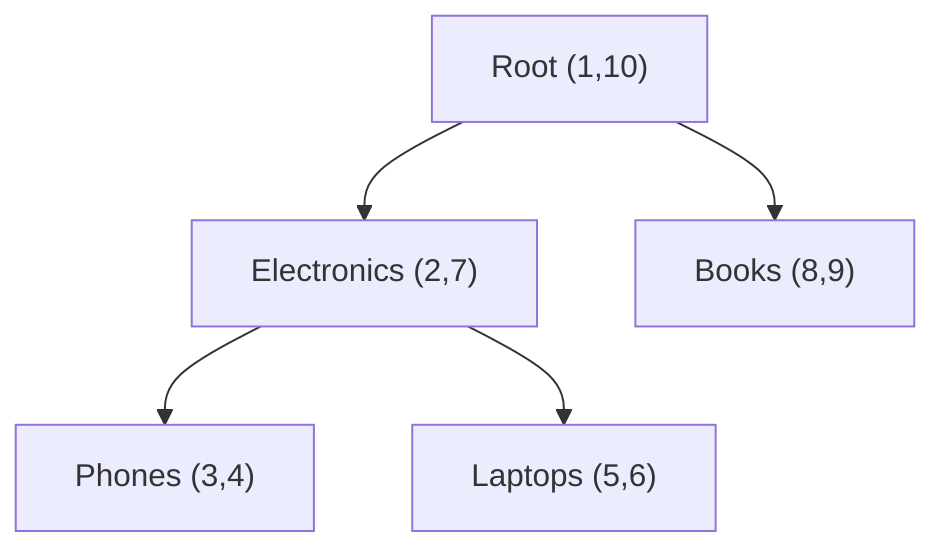
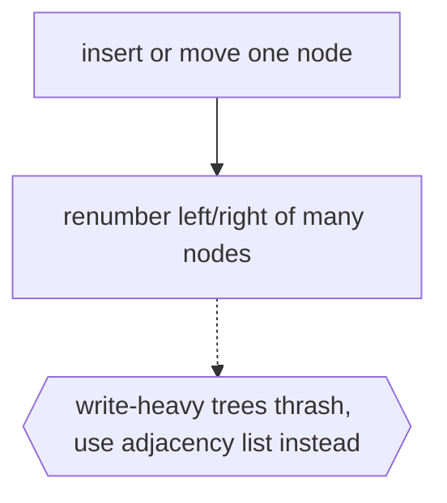

# Nested Sets

## Overview

The nested set model represents a tree through containment rather than pointers. Every node is thought of as a set that completely encloses all of its descendants. Instead of storing a parent link on each node, you assign each node two numbers, a left and a right boundary, by walking the tree and numbering as you enter and leave each node. A node is an ancestor of another exactly when its interval contains the other's interval. The whole hierarchy is captured by these nested numeric ranges.

This model shines in relational databases where recursive parent-child queries are awkward or slow. To fetch an entire subtree, you select every node whose left and right values fall inside the parent's range, a single fast range query with no recursion. The cost appears on writes. Inserting or moving a node shifts the boundary numbers of many other nodes, so updates are expensive and must renumber a range. Nested sets therefore fit read-heavy hierarchies like category trees far better than frequently reorganized ones.

### Quick Takeaways

- Each node stores a left and right boundary, and containment of ranges encodes ancestry
- Fetching a whole subtree becomes one fast range query with no recursion needed
- Reads are cheap but inserts and moves are costly because many nodes must be renumbered

## Definition

- **Nested set** is the view of each node as a set enclosing all of its descendants.
- **Left boundary** is the number assigned when the traversal first enters a node.
- **Right boundary** is the number assigned when the traversal leaves a node.
- **Containment** is the rule that ancestor ranges fully enclose descendant ranges.
- **Range query** is selecting all nodes whose boundaries lie within a given interval.
- **Renumbering** is the update work of shifting boundaries when the tree changes.

## The Analogy

Think of nested boxes. The biggest box is the root, and inside it are smaller boxes, each holding still smaller boxes. If box B sits somewhere inside box A, then A is an ancestor of B, no label needed, the physical enclosure says so. To grab a whole branch you just lift out one box and everything inside comes with it. Nested sets turn this physical containment into two boundary numbers per box.

## When You See It

- Category and taxonomy trees stored in SQL databases
- Content management systems with nested pages or menus
- Threaded comments where a whole subthread is fetched at once
- Organizational hierarchies queried far more often than they change
- Access-control trees where you check if one scope contains another
- Any read-heavy hierarchy needing fast whole-subtree retrieval

## Examples

**Good:** Storing a product category tree with left and right boundaries so the whole "Electronics" subtree loads with one range query. Reads are fast and need no recursive joins.

**Bad:** Using nested sets for a tree that is reorganized constantly, like a live drag-and-drop file manager. Every move renumbers a large range of boundaries and updates thrash the database.

## Important Points

- Ancestry is decided by range containment, not by stored parent pointers
- Boundaries are assigned by a depth-first walk numbering entry and exit of each node
- Whole-subtree reads are a single range query, the model's main strength
- Inserts, deletes, and moves renumber many nodes, the model's main weakness
- It suits read-heavy, rarely-restructured hierarchies best
- The adjacency list model is the simpler alternative when writes are frequent
- Closure tables are another alternative trading storage for flexible queries

## Summary

- The nested set model encodes a tree as nested numeric ranges, one interval per node.
- Ancestor relationships are read directly from range containment.
- Fetching an entire subtree is one fast, recursion-free range query.
- Writes are expensive because changes force renumbering of many boundaries.
- It fits read-heavy hierarchies like categories, not constantly reorganized trees.
- _Put every branch inside a box, and the boxes that enclose it are its ancestors._
