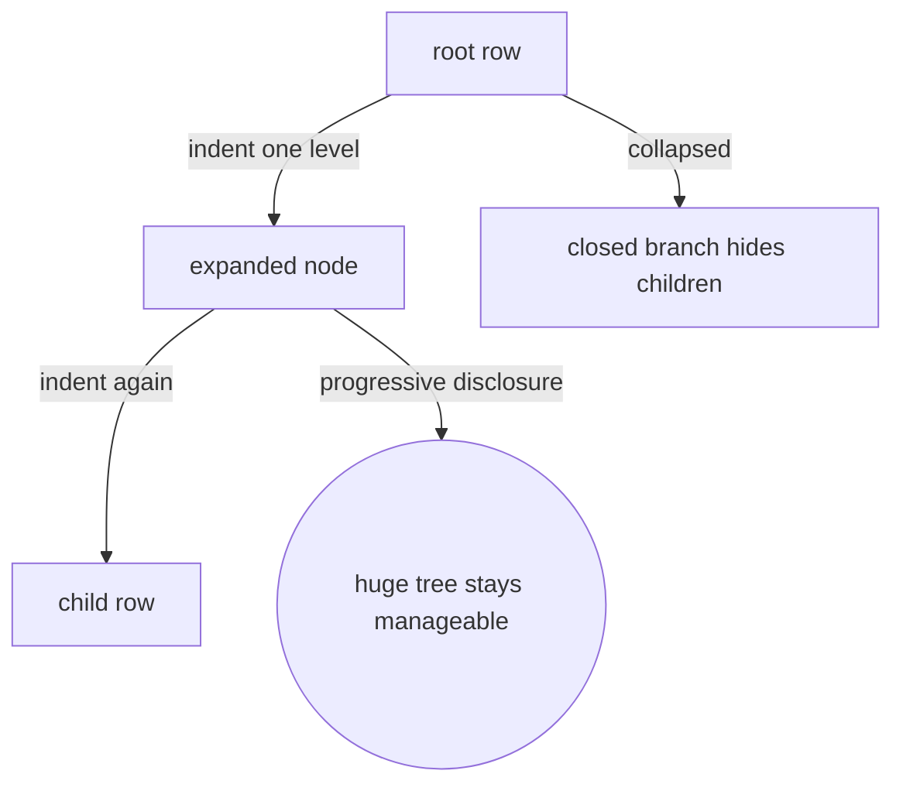
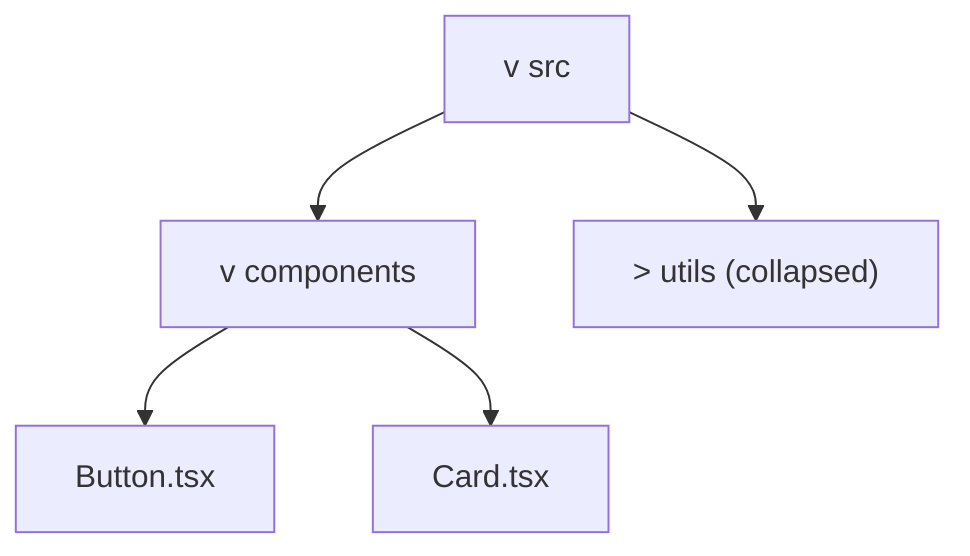
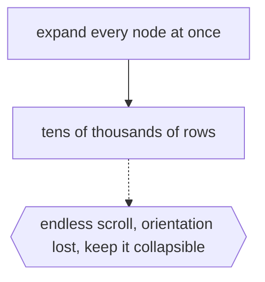

# Outlines and Tree Views

## Overview

An outline or tree view presents a hierarchy as indented rows of text. Depth is shown by indentation: the deeper a node, the further it is pushed to the right. A disclosure control, a triangle or plus sign, lets each node expand to reveal its children or collapse to hide them. This is the interface most people actually use to browse trees every day, in file explorers, document outlines, and settings menus. It trades graphical richness for compact, scrollable, interactive text.

The core idea is progressive disclosure. Instead of drawing the whole tree at once, a tree view shows the top and lets you open only the branches you care about. This keeps even enormous hierarchies manageable, since collapsed branches take no vertical space. Indentation communicates parent-child relationships without any drawn lines, though many implementations add faint guide lines to help. The limitation is that you see structure one column deep at a time and cannot easily perceive the whole shape of a large tree at a glance.

### Quick Takeaways

- Depth is shown by indentation and each node can expand or collapse its children
- Progressive disclosure keeps huge hierarchies manageable by hiding closed branches
- It is compact and interactive but hides the overall shape of the tree

## Definition

- **Row** is one line of the view representing a single node.
- **Indentation** is the horizontal offset encoding a node's depth in the tree.
- **Disclosure control** is the triangle or plus icon that expands or collapses a node.
- **Expand/collapse** is the action of showing or hiding a node's children.
- **Progressive disclosure** is revealing detail only as the user opens branches.
- **Guide line** is an optional faint line helping the eye follow indentation levels.

## The Analogy

Think of a book's table of contents that you can fold. Chapters are flush left, sections indent under them, subsections indent further. You can tap a chapter to reveal its sections or fold it back to just the title. You never print the entire book to find one section, you drill down only where you need. A tree view is that foldable table of contents made interactive.

## When You See It

- File explorers and IDE project sidebars
- Document outlines and heading navigators
- Settings and preferences menus with nested categories
- DOM inspectors in browser developer tools
- Org-mode, Markdown outliners, and note-taking apps
- Any UI browsing a large hierarchy a few branches at a time

## Examples

**Good:** Using a collapsible tree view for a project sidebar with thousands of files. The user expands only the folders they need, so the huge hierarchy stays compact and navigable.

**Bad:** Forcing a fully expanded tree view for a hierarchy of tens of thousands of nodes with no collapsing. The user scrolls endlessly and loses all sense of where they are.

## Important Points

- Indentation, not drawn links, communicates the parent-child structure
- Expand and collapse enable progressive disclosure of large hierarchies
- Collapsed branches consume no vertical space, keeping the view compact
- Guide lines are an optional aid for following deep indentation
- You perceive local structure well but the global shape poorly
- Keyboard navigation and lazy loading make very large trees usable
- It is the most widely used hierarchy interface in everyday software

## Summary

- An outline or tree view shows a hierarchy as indented, collapsible text rows.
- Indentation encodes depth and disclosure controls expand or hide children.
- Progressive disclosure keeps even massive trees compact and navigable.
- It is compact and interactive, the everyday interface for browsing hierarchies.
- Its weakness is hiding the overall shape, showing only opened branches.
- _Fold the branches you do not need, and even a giant tree fits in a sidebar._
