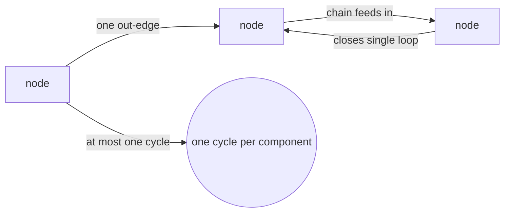
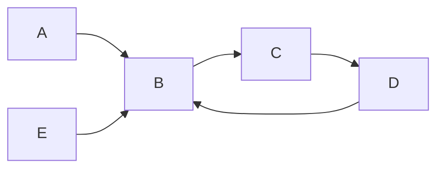
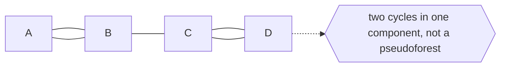

# Pseudoforest

## Overview

A pseudoforest is a graph in which every connected component contains at most one cycle. A forest, by contrast, allows no cycles at all. By permitting each component a single cycle, a pseudoforest is just one step more general than a forest. The key numeric consequence is that each component has at most as many edges as vertices. A single connected pseudoforest with exactly one cycle is called a pseudotree, and it looks like a tree with one extra edge that closes a single loop.

Pseudoforests appear naturally whenever each node has at most one outgoing edge, because following those edges can only ever wander into one loop per component. This is exactly the shape of a "functional graph," where every element points to exactly one successor. Such structures show up in disjoint-set data structures, in modeling functions on a finite set, and in memory-efficient graph algorithms. The single-cycle bound makes pseudoforests sparse and predictable, so they enjoy efficient algorithms much like forests do, while still capturing the minimal amount of cyclic structure some problems require.

### Quick Takeaways

- Every connected component may contain at most one cycle, unlike a fully acyclic forest
- Each component has at most as many edges as vertices, keeping the graph sparse
- Functional graphs, where each node has one outgoing edge, are naturally pseudoforests

## Definition

- **Forest** is a graph with no cycles, a disjoint union of trees.
- **Pseudoforest** is a graph where each connected component has at most one cycle.
- **Pseudotree** is a single connected pseudoforest with exactly one cycle.
- **Component** is a maximal connected piece of the graph.
- **Functional graph** is a directed graph where every node has exactly one out-edge.
- **Edge-vertex bound** is the property that each component has at most as many edges as vertices.

## The Analogy

Think of a group of people each pointing to exactly one other person they follow. Follow the chain of pointers and you must eventually loop, because there is nowhere new to go forever, so you circle back into one repeating cycle. Trees of followers feed into that single loop like tributaries into a whirlpool. Each separate friend group has its own single whirlpool. That "chains feeding into one loop per group" picture is a pseudoforest.

## When You See It

- Disjoint-set (union-find) structures and their parent pointers
- Functional graphs modeling a function from a finite set to itself
- Iterated maps where each state has exactly one successor
- Cycle detection in linked structures with single successors
- Sparse graph algorithms exploiting the one-cycle-per-component bound
- Memory-efficient representations needing at most one out-edge per node

## Examples

**Good:** Modeling a function on a finite set, where each element maps to exactly one other. The resulting functional graph is a pseudoforest, trees of elements feeding into one cycle per component.

**Bad:** Assuming a component with two independent cycles is still a pseudoforest. Once a component holds more than one cycle, it has more edges than vertices and the pseudoforest property breaks.

## Important Points

- The defining rule is at most one cycle per connected component
- This bounds each component to at most as many edges as vertices, so it stays sparse
- A pseudotree is the connected, exactly-one-cycle case
- Functional graphs, one out-edge per node, are always pseudoforests
- They generalize forests by the minimal addition of a single loop
- The sparsity yields efficient algorithms similar to those for forests
- Following single-successor pointers always lands in one cycle per component

## Summary

- A pseudoforest allows each connected component at most one cycle.
- This keeps edges from exceeding vertices, so the graph stays sparse.
- A connected pseudoforest with one cycle is a pseudotree.
- Functional graphs with one out-edge per node are natural pseudoforests.
- The single-cycle bound gives forest-like efficiency with minimal cyclic structure.
- _Let every chain drift into one loop and no more, and each group stays a tidy whirlpool._
