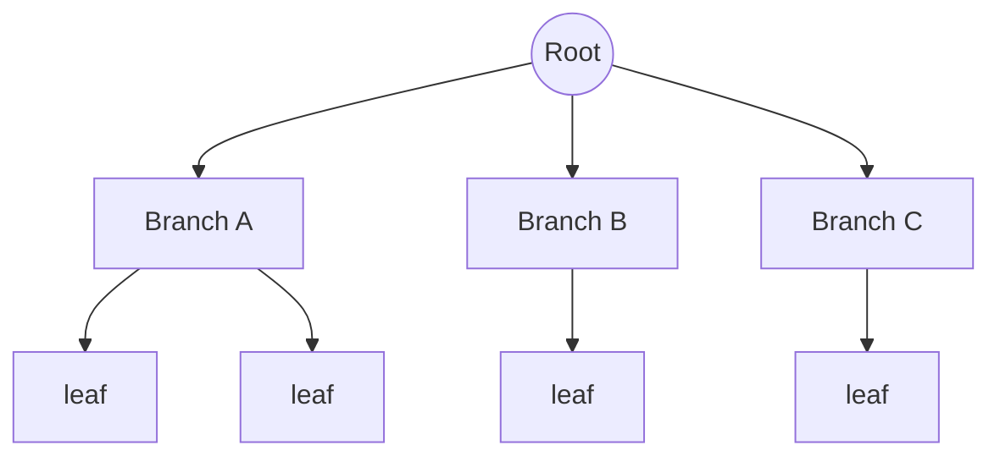
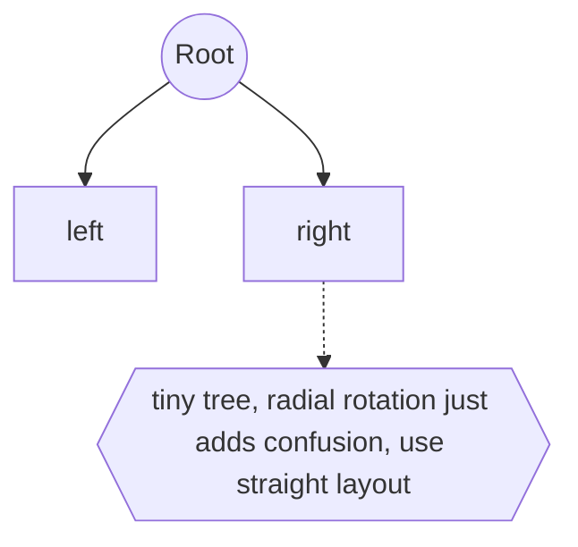

# Radial Trees

## Overview

A radial tree draws a hierarchy outward from a center. The root sits at the middle, and each successive level is placed on a wider concentric ring around it. Depth becomes radial distance: the further a node is from the center, the deeper it is. Children fan out into the angular space allotted to their parent. Links still connect parents to children as in a node-link diagram, but the layout is polar rather than top-down. The whole tree forms a circular shape.

The reason to go radial is space. A traditional top-down layout gets very wide at deep levels because each level needs horizontal room for all its nodes. A radial layout gives each ring a full 360 degrees, and outer rings have more circumference, so wide levels fit more gracefully. This makes radial trees good for large, bushy hierarchies where the balanced circular shape uses the canvas efficiently. The downside is that labels rotate around the circle and can be harder to read, and precise comparison across branches is less intuitive than in a straight layout.

### Quick Takeaways

- The root is centered and depth is drawn as distance outward along concentric rings
- Outer rings have more circumference, so wide levels fit more gracefully than top-down
- The circular shape is space-efficient but rotated labels and cross-branch reading suffer

## Definition

- **Center** is the position of the root node at the middle of the layout.
- **Ring** is a concentric circle holding all nodes at a given depth.
- **Radial distance** is a node's distance from the center, encoding its depth.
- **Angular span** is the slice of the circle allotted to a subtree.
- **Polar layout** is positioning nodes by angle and radius rather than x and y.
- **Fan-out** is how children spread across their parent's angular span.

## The Analogy

Think of ripples spreading from a stone dropped in a pond. The stone is the root at the center, and each ripple ring further out is a deeper level of the tree. Things close to the splash are near the top of the hierarchy, things far out are deep leaves. The circular spreading uses the whole surface evenly instead of stretching in one direction. A radial tree is that ripple pattern turned into a hierarchy drawing.

## When You See It

- Large phylogenetic trees drawn compactly in biology
- Network and dependency maps radiating from a central hub
- Mind maps that branch symmetrically around a central topic
- File system or taxonomy overviews needing a compact whole-tree view
- Sunburst-adjacent visualizations emphasizing a central root
- Any bushy hierarchy where a top-down layout would be too wide

## Examples

**Good:** Drawing a large, bushy taxonomy as a radial tree so all levels fit in a compact circle. The outer rings absorb the many leaf nodes that would overflow a top-down layout.

**Bad:** Using a radial layout for a small three-node tree or when users must compare exact depths across branches. The rotation adds confusion with none of the space benefit.

## Important Points

- Depth maps to radial distance and each level occupies a concentric ring
- Outer rings offer more circumference, absorbing wide levels gracefully
- Links between parent and child are still drawn, only the coordinates are polar
- It suits large, bushy trees where top-down layouts grow too wide
- Rotated labels around the circle reduce readability
- Comparing exact depth or size across distant branches is less intuitive
- The sunburst is a space-filling radial cousin using wedges instead of links

## Summary

- A radial tree places the root at the center and grows outward through concentric rings.
- Depth becomes radial distance and subtrees claim angular slices of the circle.
- The circular shape uses space efficiently for large, bushy hierarchies.
- It struggles with rotated labels and cross-branch comparison.
- For small trees a straight layout is clearer, radial pays off only at scale.
- _Drop the root in the middle and let the levels ripple outward to fill the circle._
