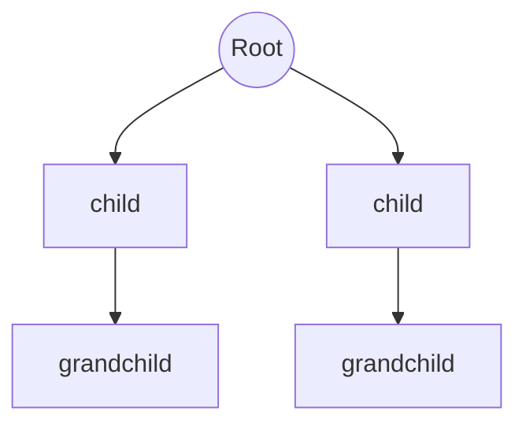
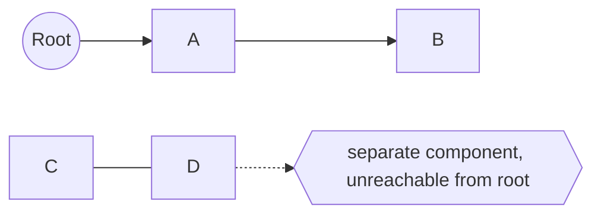

# Rooted Graph

## Overview

A rooted graph is simply a graph together with one distinguished vertex singled out as the root. The graph itself can be anything, a tree, a DAG, or a general graph with cycles. What "rooting" adds is a fixed reference point: a special vertex from which traversal begins and against which other vertices are measured. This small addition matters because it turns an otherwise symmetric structure into one with a clear starting place and a sense of orientation.

Choosing a root is a lightweight but powerful act. In a tree, picking a root instantly induces parent-child directions, depths, and subtrees, converting an unrooted tree into the familiar hierarchical one. In a general graph, a root defines reachability, which vertices you can get to from the start, and grounds algorithms like breadth-first and depth-first search that must begin somewhere. The root also serves as an anchor for accessibility conditions, spanning-tree construction, and pointer-based traversal. The key insight is that the graph's edges stay the same; rooting only adds a distinguished vantage point from which to view and traverse it.

### Quick Takeaways

- A rooted graph is any graph with one vertex singled out as the root
- The root gives a fixed starting point and a sense of orientation for traversal
- Rooting a tree induces parent-child direction, depth, and subtrees automatically

## Definition

- **Graph** is a set of vertices connected by edges, possibly with cycles.
- **Root** is the single distinguished vertex chosen as the reference point.
- **Rooting** is the act of designating that root on an otherwise unmarked graph.
- **Reachability** is the set of vertices accessible from the root by following edges.
- **Orientation** is the sense of direction that a chosen root imposes.
- **Spanning tree** is a tree reaching all vertices, often grown outward from the root.

## The Analogy

Think of a subway map before and after you mark "You Are Here." The stations and lines are identical either way, but the moment you plant that marker, distances, directions, and routes all gain meaning relative to your spot. You can now say which stations are near, how many stops away each is, and where to start walking. A rooted graph is a graph with that "You Are Here" marker placed on one vertex.

## When You See It

- Rooting a tree to induce hierarchy, parents, children, and depth
- Breadth-first and depth-first search starting from a designated source
- Reachability analysis from an entry point in a program or network
- Spanning-tree construction grown outward from a chosen root
- Web crawling or graph exploration beginning at a seed page
- Any algorithm that needs a fixed vertex to start from

## Examples

**Good:** Rooting an unrooted tree at a chosen vertex so it gains parent-child direction and depth. Traversal, subtree queries, and hierarchy all become well defined from that root.

**Bad:** Running a traversal that assumes a single reachable component from the root when the graph is disconnected. Vertices in other components are never visited because no path leads from the root.

## Important Points

- A rooted graph is any graph plus one chosen distinguished vertex
- The underlying edges are unchanged, rooting only adds a reference point
- Rooting a tree induces direction, depth, and subtrees for free
- The root grounds traversals like BFS and DFS that must start somewhere
- Reachability from the root can miss vertices in disconnected components
- Roots anchor spanning-tree and accessibility constructions
- The concept spans trees, DAGs, and general graphs alike

## Summary

- A rooted graph is a graph with one vertex distinguished as the root.
- The root provides a fixed starting point and a sense of orientation.
- Rooting a tree induces parent-child direction, depth, and subtrees.
- It grounds traversals and reachability analysis that need a source.
- The edges are unchanged, rooting only adds a vantage point.
- _Plant a "You Are Here" marker on one vertex and the whole graph gains direction._
