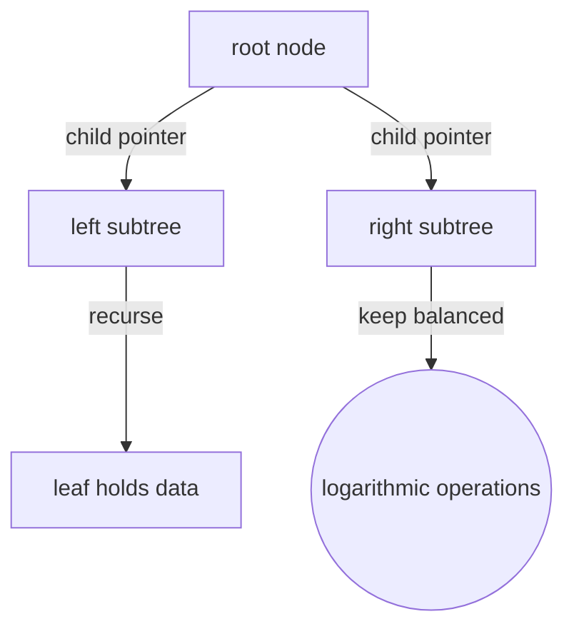
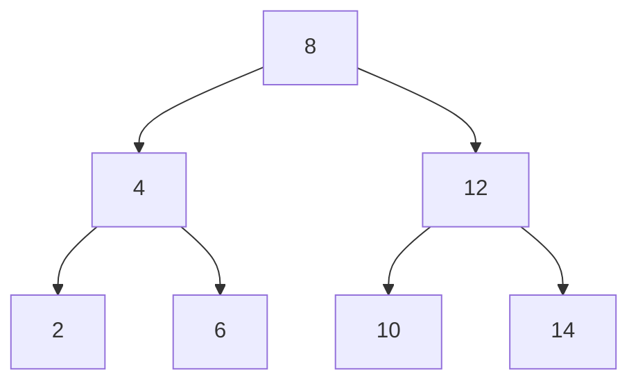

# Tree (Data Structure)

## Overview

A tree data structure is the concrete, in-memory realization of the tree concept. It is built from nodes, where each node holds some data plus references (pointers) to its child nodes. One node is designated the root, and starting from it you can reach every other node by following child references. Unlike an array or list, which is linear, a tree branches, which lets it represent hierarchy directly and support fast operations that exploit that branching. It is one of the most important structures in computer science.

The power of a tree data structure comes from recursion and balance. Because each child is itself the root of a subtree, most tree algorithms are written recursively: do something with the node, then recurse into each child. Traversals like preorder, inorder, and postorder visit nodes in principled sequences. Specialized trees add invariants for speed: a binary search tree keeps left less than right for logarithmic lookup, a heap keeps parents ordered against children for fast priority access, and balanced trees like AVL or red-black guarantee the tree never grows lopsided. When balance is maintained, key operations run in logarithmic time; when it degrades, a tree can decay into a slow linked list.



### Quick Takeaways

- A tree is built from nodes holding data and references to their children, rooted at one node
- Its branching shape enables recursive algorithms and fast, hierarchy-aware operations
- Balance is critical: a balanced tree gives logarithmic operations, an unbalanced one degrades

## Definition

- **Node** is the unit holding data and references to child nodes.
- **Root** is the entry node from which all others are reachable.
- **Pointer** is a reference from a parent node to a child node.
- **Traversal** is a systematic order of visiting nodes, such as preorder or inorder.
- **Binary search tree** is a tree keeping left keys below and right keys above each node.
- **Balancing** is maintaining roughly equal subtree heights to keep operations fast.

## The Analogy

Think of a company phone directory built as linked cards. The top card is the CEO and lists cards for direct reports, each of which lists cards for their reports, and so on. To find someone you start at the top and follow the card references down the right branch. If the branching is even you reach anyone in a few hops, but if everyone reports in one long chain, you are back to flipping through a single stack. That linked, branching directory is a tree data structure.

## When You See It

- Binary search trees for ordered lookup, insertion, and deletion
- Heaps backing priority queues and scheduling
- Balanced trees (AVL, red-black) inside language libraries and databases
- B-trees and B+ trees indexing data on disk in databases and filesystems
- Tries for prefix search and autocomplete
- Parse and syntax trees inside compilers and interpreters

## Examples

**Good:** Using a balanced binary search tree so lookups, inserts, and deletes all run in logarithmic time. The subtree heights stay even, keeping every path from the root short.



**Bad:** Inserting already-sorted keys into a plain, unbalanced binary search tree. Every node becomes a right child, the tree degenerates into a linked list, and lookups fall to linear time.

```mermaid
flowchart TB
  A["1"] --> B["2"]
  B --> C["3"]
  C --> D["4"]
  D -.-> X{{degenerate chain, O(n) lookups, use a balanced tree}}
```

## Important Points

- Nodes store data and child references, with one node serving as the root
- Most tree algorithms are naturally recursive, one node then its subtrees
- Traversal orders (pre, in, post, level) visit nodes for different purposes
- Search-tree and heap invariants enable fast ordered or priority operations
- Balanced variants guarantee logarithmic height and thus fast operations
- Without balancing, a tree can degenerate into a linear list
- Disk-oriented B-trees widen nodes to minimize expensive I/O

## Summary

- A tree data structure realizes the tree concept as nodes with child references in memory.
- Its branching shape supports recursion and fast hierarchy-aware operations.
- Search trees, heaps, and tries add invariants for ordered or priority access.
- Balanced trees keep height logarithmic, guaranteeing fast operations.
- An unbalanced tree can degrade into a slow linked list.
- _Follow the child pointers from the root, and keep the branches even so the paths stay short._
