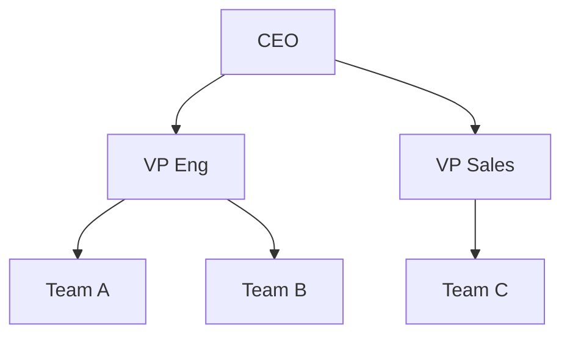
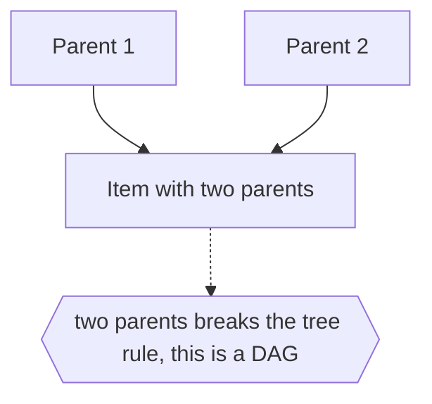

# Tree Structure (General)

## Overview

A tree structure is the general concept of hierarchy: a set of items connected so that one item is the root and every other item descends from it through a unique chain of parent-child links. There are no cycles and no item has two parents. This abstract shape appears everywhere, independent of how it is drawn, stored, or computed. Before it is a data structure or a diagram, "tree" is simply the idea that things nest under one another in levels.

The concept is defined by a few invariants. There is exactly one root, the item with no parent. Every other item has exactly one parent, so lineage is unambiguous. Following parent links always leads back to the root, and there is exactly one path between the root and any item. These rules give the tree its two hallmark powers: clear ownership, since each item belongs to one parent, and clean recursion, since every subtree is itself a smaller tree of the same kind. This is why hierarchy is such a natural way to organize the world, and why more specialized tree ideas all build on this common core.

### Quick Takeaways

- A tree is the abstract idea of hierarchy: one root and unique parent-child chains
- The invariants are one root, one parent per node, no cycles, one path between any two nodes
- Every subtree is itself a tree, which is why hierarchy recurses so cleanly

## Definition

- **Root** is the single top item that has no parent.
- **Parent** is the item directly above a given item in the hierarchy.
- **Child** is an item directly below and owned by a parent.
- **Leaf** is an item with no children.
- **Path** is the sequence of links between two items, unique in a tree.
- **Subtree** is any item together with all of its descendants, itself a tree.

## The Analogy

Think of the way you organize belongings into boxes, boxes into shelves, shelves into a single closet. The closet is the root, everything lives somewhere inside it, and each thing sits in exactly one box on exactly one shelf. Nothing belongs to two shelves at once, and there is one clear route from the closet down to any single item. That clean, single-owner nesting is the general idea of a tree structure.

## When You See It

- File systems organizing files under folders under a root
- Organization charts and any reporting hierarchy
- Document structure with sections, subsections, and paragraphs
- Biological taxonomies classifying life into nested ranks
- Menus, categories, and any nested navigation
- Any domain where items belong to exactly one parent

## Examples

**Good:** Organizing a company as a tree where each employee reports to exactly one manager up to a single CEO. Ownership is clear and every person has one unambiguous chain of command.

**Bad:** Trying to model a structure where an item legitimately has two parents as a plain tree. The single-parent rule is violated, so the relationship is really a DAG, not a tree.

## Important Points

- Exactly one root anchors the whole hierarchy
- Every non-root item has exactly one parent, giving unambiguous ownership
- There are no cycles, and exactly one path connects any two items
- Every subtree is itself a tree, enabling natural recursion
- The concept is independent of drawing, storage, or algorithm
- Violating single-parent or acyclicity turns it into a DAG or general graph
- All specialized tree ideas inherit these core invariants

## Summary

- A tree structure is the abstract concept of hierarchy with one root and unique lineage.
- Its invariants are one root, one parent per node, no cycles, one path between nodes.
- These give clear ownership and clean recursion over subtrees.
- It is independent of how the tree is drawn, stored, or processed.
- Breaking single-parent or acyclicity yields a DAG or general graph instead.
- _Everything hangs from one root by a single clear thread, and that is all a tree really is._
