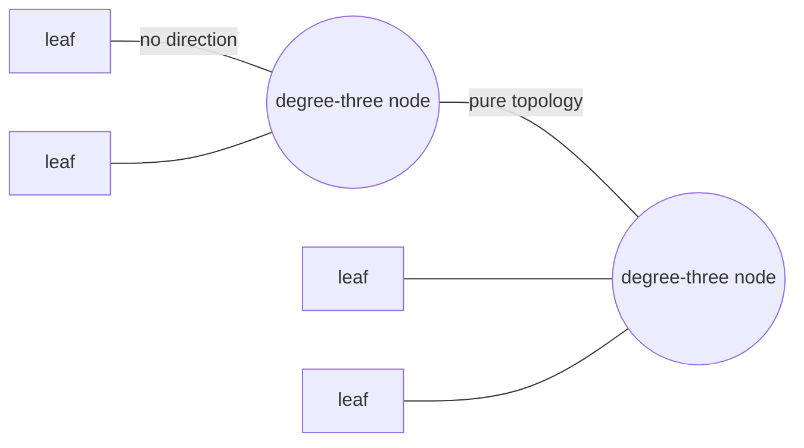
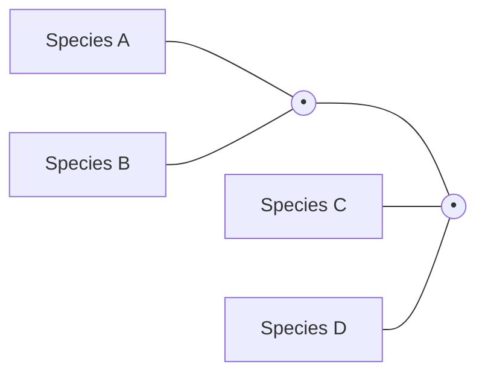
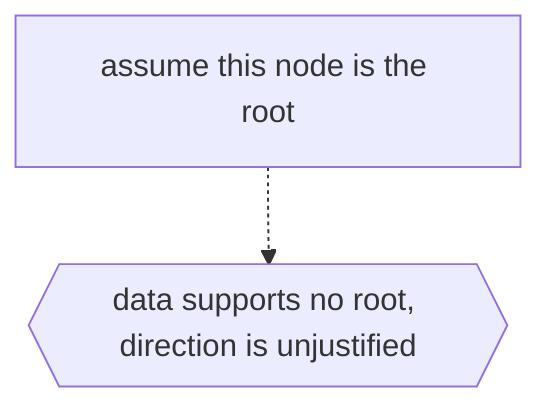

# Unrooted Binary Tree

## Overview

An unrooted binary tree is a tree with no distinguished root and a strict degree rule: every internal node touches exactly three edges, while leaves touch exactly one. Because there is no root, there is no notion of parent, child, up, or down. The tree only expresses how the leaves are related to one another through the branching pattern, not any direction of descent. It captures pure topology, the shape of the connections, stripped of hierarchy.

This structure is central to phylogenetics, the study of evolutionary relationships. Species sit at the leaves, and the internal degree-three nodes represent hypothetical common ancestors where lineages split in two. An unrooted tree says which species are more closely related without claiming which came first, because the data often cannot tell you where the root belongs. To add a direction of time you "root" the tree by picking a point, often using an outgroup, which turns it into an ordinary rooted binary tree. The unrooted form is thus the honest representation when you know the branching but not the origin.

### Quick Takeaways

- There is no root, so no parent-child direction exists, only relationships among leaves
- Every internal node has degree exactly three, and every leaf has degree exactly one
- It captures pure topology, and rooting it later adds the direction of descent

## Definition

- **Unrooted** means no node is singled out as the root, so there is no up or down.
- **Internal node** is a branching point of degree exactly three.
- **Leaf** is a terminal node of degree one, often a species or taxon.
- **Edge** is a connection whose length may represent evolutionary distance.
- **Topology** is the branching pattern of the tree independent of any root.
- **Rooting** is choosing a point to impose direction, yielding a rooted tree.

## The Analogy

Think of a road map showing towns connected by intersections, where every intersection is a three-way fork. The map tells you how the towns link up and which are neighbors, but it says nothing about a "starting town" or a direction of travel. Only when you declare one town your origin does "toward" and "away" appear. An unrooted binary tree is that map of three-way forks, and rooting it is picking the origin town.

## When You See It

- Phylogenetic trees inferred from genetic sequence data
- Evolutionary biology where the true root is unknown without an outgroup
- Studies of relatedness that avoid unjustified directional claims
- Tree topology enumeration and comparison in computational biology
- Distance-based clustering that yields unrooted relationships
- Any relational tree where direction of descent is not determined by the data

## Examples

**Good:** Representing an inferred evolutionary tree of four species as unrooted, showing which species pair off without claiming an ancestor. Each internal fork is a degree-three split among lineages.

**Bad:** Reading a rooted "first ancestor" into an unrooted tree when the data does not support any root location. You claim a direction of descent the topology alone cannot justify.

## Important Points

- No root means no parent-child direction, only mutual relationships among leaves
- Internal nodes are strictly degree three, leaves strictly degree one
- The structure encodes topology, not a timeline of descent
- Phylogenetics uses it because sequence data often cannot locate the root
- Rooting, often via an outgroup, converts it to a rooted binary tree
- Edge lengths may carry distance while the topology carries relatedness
- Counting distinct unrooted topologies grows rapidly with the number of leaves

## Summary

- An unrooted binary tree has no root and internal nodes all of degree three.
- It expresses relationships among leaves without any direction of descent.
- It captures pure topology, the branching pattern alone.
- Phylogenetics relies on it when the root cannot be determined from data.
- Rooting it later, often with an outgroup, adds the arrow of time.
- _It tells you who is related to whom, but not who came first, until you pick a root._
