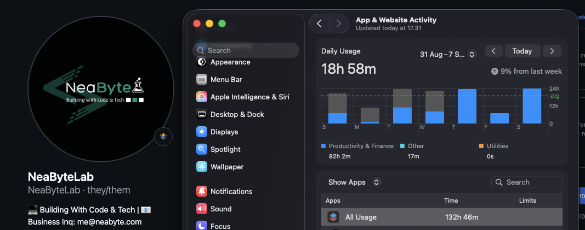

# Dev Stories

_Tales from the keyboard trenches_

## Table of Contents

- [The Time I Tracked My Screen Time](#the-time-i-tracked-my-screen-time)
- [The Time I Over-Abstracted](#the-time-i-over-abstracted)
- [When DRY Bites Back](#when-dry-bites-back)
- [2am Debugging Sessions](#2am-debugging-sessions)
- [The Feature That Should Have Been Simple](#the-feature-that-should-have-been-simple)
- [Learning the Hard Way](#learning-the-hard-way)

---

## The Time I Tracked My Screen Time

_Or: When 15-18 hours a day doesn't make you experienced_

So I started tracking my screen time. You know, to be accountable to myself. See where my time actually goes.

| Week | Hours | Oof Level                              |
| ---- | ----- | -------------------------------------- |
| 1    | 110h  | Oof                                    |
| 2    | 132h  | Hmm, that's more than a full work week |
| 3    | 121h  | Still high                             |

I'm looking at this data and thinking: "Wow, I must be really productive! Look at all those hours!"




But here's the thing: I'm not an experienced developer. Not really.

I've spent 14 years in tech. My first programming language was Visual Basic. Remember that? Yeah, me too.

I learned everything: VB, then C#, then Java, then Python, then JavaScript, TypeScript, React, Electron, Go, Rust... the list keeps growing. But it's not just code. I also studied Sysadmin, Networking, Security, Finance - how systems actually work.

I keep learning new tech because there's so much to learn. I spend 15-18 hours a day reading and learning, jumping from one framework to another, one language to the next. Sometimes I can use them well. Sometimes I just know them enough to build. But master them? That takes time. After 14 years, I still feel like there's everything left to learn.

Let me be honest about what those hours really are:

- Reading documentation for 5 different frameworks (because who commits to just one?)
- Studying how things work under the hood (ask me about event loops, I dare you)
- Learning optimization techniques (gotta go fast!)
- Diving into system design fundamentals (because CRUD is boring)
- Understanding algorithms and data structures deeply (yes, I care about Big O)

I'm actually bored of learning how to build CRUD apps. Bored of building UI components. Bored of making another ToDo app. (Seriously, can we stop with the ToDo apps already?)

Those hours are spent on understanding HOW it works, not just how to use it. There's a difference.

I look at my screen time and think: "I'm getting old, but it's okay."

It's part of the journey. I'm a maniac about tech. I can't help myself. New thing comes out? I need to understand it. New pattern? Let me try it. New framework? Sign me up. I'm still learning. Still curious. Still spending too many hours reading docs at 2am when I should be sleeping. And I'm okay with that. 😅

**The real lesson:** Hours spent staring at a screen don't make you experienced. Shipping things does. But first, you gotta learn how everything works. And that's where those 18-hour days go.

## The Time I Over-Abstracted

_Or: How I learned that KISS isn't just a principle, it's a lifesaver_

So there I was, building an email system. Not a big deal, right? Just send some emails.

Wrong.

I spent 3 days creating:

- An `IEmailProvider` interface (because we might need multiple providers!)
- A `EmailService` class with dependency injection
- An abstract factory pattern for... reasons?
- Multiple layers of abstraction for error handling
- A whole strategy pattern just in case we want to switch providers

You know what happened? The feature was cancelled.

I spent 3 days building infrastructure for a feature that never shipped. All I actually needed was one simple function:

```typescript
async function sendEmail(to: string, subject: string, body: string) {
  // Actually send email
}
```

**Lesson learned:** Start simple. Add complexity when you actually need it. Not before.

And yeah, I still have that over-engineered code sitting in my commit history as a reminder. Thanks, past me. 😅

## When DRY Bites Back

_Or: When too much abstraction creates worse problems_

I'm a big fan of DRY. Love it. "Don't repeat yourself" - heck yes!

But I took it too far once.

I had validation logic for users. Then for products. Then for orders. They all looked similar, so I thought: "Perfect! Let's extract this."

So I created a super-generic validation system:

```typescript
abstract class BaseValidator<T> {
  abstract validate(entity: T): ValidationResult

  validateAndThrow(entity: T): void {
    const result = this.validate(entity)
    if (!result.isValid) {
      throw new ValidationError(result)
    }
  }
}

class UserValidator extends BaseValidator<User> {
  validate(user: User): ValidationResult {
    // Generic validation...
  }
}

// ... and on and on
```

Six months later, the user validation requirements changed. The products and orders validations didn't.

My beautiful abstraction? Now I'm breaking everything. One change to the base class affects all three validators. Products validation breaks because it didn't need that specific user rule. Orders validation has its own quirks.

I spent more time fighting the abstraction than I would have fixing three separate validation functions.

**Lesson learned:** Sometimes duplication is better than wrong abstraction. If things might diverge, keep them separate.

DRY is great. But use it when it helps, not when it creates a mess.

## 2am Debugging Sessions

_Or: Why simple code saves your sanity_

We've all been there. 2am. Production is broken. Your code that worked perfectly yesterday is now throwing errors. You can't remember why you made it this way.

Let me tell you about the worst debugging session I ever had.

The bug? A simple calculation was returning wrong results sometimes.

I traced through the code... nested ternary operators:

```typescript
const price = isPremium
  ? discount > 0.1
    ? basePrice * 0.8
    : basePrice * 0.9
  : quantity > 10
  ? basePrice * 0.85
  : basePrice
```

You try debugging THAT at 2am. My brain couldn't parse the logic anymore. I spent 2 hours trying to figure out why the price was wrong.

Eventually, I just rewrote it:

```typescript
let price = basePrice

if (isPremium) {
  if (discount > 0.1) {
    price = basePrice * 0.8
  } else {
    price = basePrice * 0.9
  }
} else {
  if (quantity > 10) {
    price = basePrice * 0.85
  }
}
```

Suddenly, the bug was obvious. And fixable in 5 minutes.

**Lesson learned:** Write code that's easy to debug at 2am. Because you WILL debug it at 2am.

Simple code isn't boring. It's a gift to your future self.

## The Feature That Should Have Been Simple

_Or: How over-planning wastes time_

I needed to add a "forgot password" feature. Simple, right? Send an email with a reset link.

I spent a full day planning:

- Email templates
- Reset token generation strategy
- Database schema for tokens
- Token expiration handling
- Security considerations
- User experience flow
- Rate limiting
- Testing strategy
- Edge cases

All for a feature that takes 2 hours to build.

I was so busy planning that I forgot to actually build it. When I finally started coding, I realized half my "perfect" plan didn't even apply. The requirements were simpler than I thought.

You know what I did? Built the simplest version. It works. Could it be improved? Sure. Will it ever need to handle millions of requests? Probably not. And if it does, we can refactor then.

**Lesson learned:** Start building. You'll learn what you actually need as you build it.

Perfect is the enemy of shipped.

## Learning the Hard Way

_Or: My journey from clever to simple_

When I first started coding, I thought complex code meant I was smart. The more abstractions, the better developer I was.

Boy, was I wrong.

I wrote code like this:

```typescript
const result = data
  .map(x => x.value)
  .filter(v => v !== null)
  .reduce(
    (acc, val) => {
      acc[val % 2 === 0 ? 'even' : 'odd'].push(val)
      return acc
    },
    { even: [], odd: [] }
  )
```

Beautiful one-liner! So clever!

Until 3 months later, someone found a bug. I couldn't understand my own code anymore. I had to trace through every step to figure out what it was supposed to do.

Now I write code like this:

```typescript
const evenNumbers: number[] = []
const oddNumbers: number[] = []

for (const num of numbers) {
  if (num % 2 === 0) {
    evenNumbers.push(num)
  } else {
    oddNumbers.push(num)
  }
}

const result = { even: evenNumbers, odd: oddNumbers }
```

Boring? Maybe. But understandable? Absolutely.

**Lesson learned:** Clever code impresses no one when it's unmaintainable. Simple code that works is always the right choice.

Your future self (and your teammates) will thank you for boring, obvious code.

---

## Remember

These stories aren't unique to me. Every developer has had that moment when they realize:

- You can't understand your own code after 2 weeks
- That "perfect abstraction" is now breaking everything
- You spent 3 days building something that took 2 hours
- Your clever one-liner made debugging a nightmare

But that's how we learn. We all write bad code. We all over-engineer. We all think we're clever until we're debugging at 2am.

The trick is learning from it. Keep it simple. Write for your future self. And when you make mistakes (you will), learn from them.

_Don't be afraid to write boring code. Boring is underrated._
